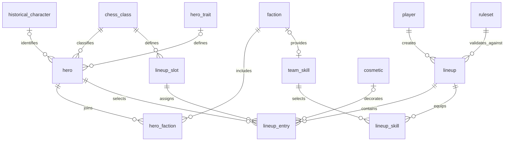
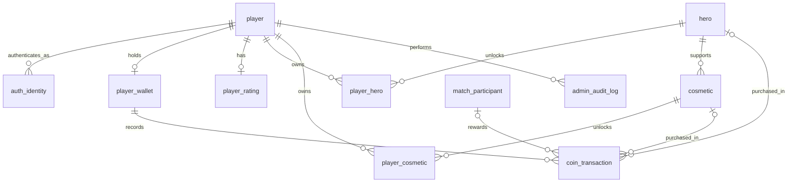
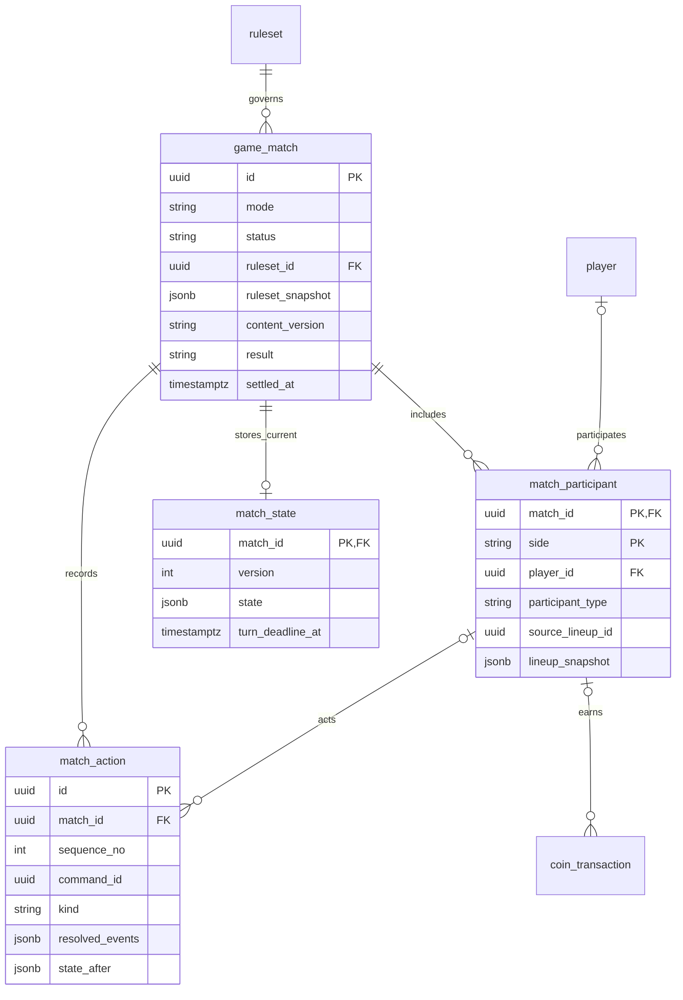

# HERO CHESS — ERD vật lý prototype

> Schema mới ngày 24/09: chạy migration 06_user_inheritance.sql sau baseline 01/04/05 và trước seed 03. Bảng player + identity.app_user được hợp nhất thành user_account; auth_identity.user_id và admin_audit_log.actor_user_id thay tên cũ. Sơ đồ/dictionary dưới đây là baseline lịch sử. Xem [mô hình hiện tại](/D:/Code/Github/HeroChessBackend/docs/User_Player_Admin_Refactor.md).

Tên entity dưới đây trùng tên bảng trong schema `hero_chess`. PK/FK và đầy đủ cột nằm trong SQL/data dictionary. Sơ đồ chia ba nhóm để đọc thuận tiện. Đường quan hệ chỉ biểu diễn FK thật; snapshot JSON không tạo FK tới catalog/lineup.

## 1. Nội dung và đội hình

`lineup_entry` có composite FK để class hero đúng class slot. Đủ 16 entry và đúng ba skill là invariant của API lưu lineup, nên cardinality vật lý vẫn 0..n. Một faction có tối đa một skill; muốn bắt buộc có đúng một khi phát hành, backend kiểm tra catalog.

## 2. Tài khoản, tài sản và coin

Tạo player + wallet + rating trong cùng transaction khi onboarding. DB cho phép chưa có wallet/rating trước khi onboarding xong. Ledger reward tham chiếu đúng player/side thuộc trận bằng composite FK.

## 3. Trận và replay

Trận selecting có thể chưa đủ hai participant; active/completed bắt buộc đủ hai. Bot participant không có playerId. Ranked không cho bot/guest. `source_lineup_id` chỉ là dấu vết nguồn, không có FK vì lineup có thể bị xóa sau trận. Replay là dữ liệu match_action, không có bảng replay trùng lặp.
