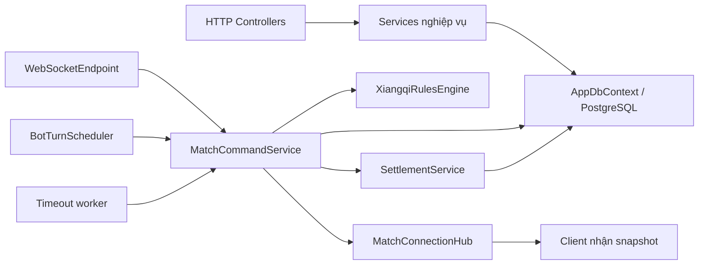

# Đọc HeroChessBackend từ góc nhìn Java → C#

Đối chiếu source ngày 23/09/2026; cập nhật mô hình User/Player/Admin ngày 24/09/2026. Hướng dẫn này giải thích code đang có, không coi kế hoạch hoặc schema dự phòng là chức năng đã chạy. Đợt chú thích ban đầu chỉ thêm comment; refactor ngày 24/09 thay đổi logic tài khoản, xem [User_Player_Admin_Refactor.md](/D:/Code/Github/HeroChessBackend/docs/User_Player_Admin_Refactor.md). Phụ lục cuối liệt kê toàn bộ 96 file source/config/tài liệu có trước đợt này; không liệt kê từng file tự sinh trong `bin`, `obj`, `.git`, keys hoặc artifacts.

Nếu đang cần báo cáo với thầy, đọc [Conceptual ERD Admin/Bot](/D:/Code/Github/HeroChessBackend/docs/Conceptual_ERD_Admin_Bot.md) và mở [sơ đồ kéo thả draw.io](/D:/Code/Github/HeroChessBackend/docs/Conceptual_ERD_Admin_Bot.drawio).

## 1. Bắt đầu đọc ở đâu?

Đọc theo thứ tự này sẽ dễ hơn đọc tất cả file từ trên xuống:

1. [Program.cs](/D:/Code/Github/HeroChessBackend/HeroChess.Api/Program.cs): app khởi động, đăng ký dependency và endpoint.
2. [ApiContracts.cs](/D:/Code/Github/HeroChessBackend/HeroChess.Contracts/ApiContracts.cs): request/response client nói chuyện với server.
3. [GameModels.cs](/D:/Code/Github/HeroChessBackend/HeroChess.Rules/GameModels.cs): một bàn cờ trong RAM gồm những gì.
4. [XiangqiRulesEngine.cs](/D:/Code/Github/HeroChessBackend/HeroChess.Rules/XiangqiRulesEngine.cs): kiểm tra/sinh nước đi hợp lệ, không cần DB.
5. [MatchCommandService.cs](/D:/Code/Github/HeroChessBackend/HeroChess.Api/Services/MatchCommandService.cs): ghép luật với quyền người chơi, deadline, transaction và broadcast.
6. [Entities.cs](/D:/Code/Github/HeroChessBackend/HeroChess.Api/Data/Entities.cs) rồi [AppDbContext.cs](/D:/Code/Github/HeroChessBackend/HeroChess.Api/Data/AppDbContext.cs): dữ liệu được lưu PostgreSQL như thế nào.
7. Chọn một luồng bên dưới rồi đọc controller → service → test tương ứng.

## 2. Bản đồ thư mục

| Thư mục | Trách nhiệm | Gần với Java |
|---|---|---|
| `HeroChess.Api/` | Web host ASP.NET Core .NET 10; auth, HTTP, WS, DB, worker | Spring Boot application |
| `Api/Auth/` | Adapter Identity, claims và player hiện tại | Security principal + UserDetails/storage adapter |
| `Api/Controllers/` | Nhận HTTP, bind input, lấy actor từ token, gọi service | `@RestController` |
| `Api/Services/` | Nghiệp vụ đội hình/trận/shop; cả worker và singleton runtime | Service layer, scheduler, policy |
| `Api/Data/` | EF entity và mapping DbContext | JPA entity + EntityManager/mapping |
| `Api/Data/Bootstrap/` | Startup chạy SQL có kiểm soát | Database initializer; không phải EF migrations |
| `Api/Infrastructure/` | Chuẩn JSON, lỗi nghiệp vụ, middleware lỗi | Serializer config + exception advice/filter |
| `Api/Properties/` | Profile khởi chạy local | IDE run configuration |
| `Api/wwwroot/` | HTML/CSS/JS demo cùng origin với API | Static resources |
| `HeroChess.Contracts/` | DTO dùng chung, .NET Standard 2.1 | Module DTO/Java records |
| `HeroChess.Rules/` | Model và engine luật thuần C#, .NET Standard 2.1 | Domain library độc lập framework |
| `tests/HeroChess.Rules.Tests/` | Unit test luật, không DB | Unit test domain |
| `tests/HeroChess.IntegrationTests/` | API/DB/socket/service regression | Spring integration tests + test database |
| `tests/web/` | Node VM với DOM/socket giả | Unit test client logic |
| `tests/live/` | HTTP/WS đến server thật đang chạy | Smoke test môi trường |
| `Hero_Chess_DB_Prototype_v0_1/` | SQL nguồn, seed, dictionary và thiết kế ban đầu | DDL/scripts + tài liệu DB |
| `docs/` | Kế hoạch, quyết định, API đã làm, review và hướng dẫn | Tài liệu dự án |

`bin/` là output biên dịch; `obj/` là file trung gian của build/restore; `TestResults/` là kết quả test; `keys/` chứa Data Protection keys; `artifacts/` chứa log/công cụ tạm. Không sửa các thư mục này để thay đổi chức năng app. `.git/` là dữ liệu quản lý phiên bản. `.env` là cấu hình local, không phải source để chia sẻ.

Đường dẫn viết tắt `Api/...` trong bảng có nghĩa nằm dưới `HeroChess.Api/...`.

## 3. Những cú pháp C# đang gặp

| C# trong repo | Cách hiểu khi biết Java |
|---|---|
| `.slnx` / `.csproj` / NuGet | Solution gom project; project khai báo target framework, package, references; tương tự aggregator/module/dependencies trong Maven, không hoàn toàn cùng cơ chế |
| `namespace X;` / `using X;` | Gần `package` / `import`; namespace không bắt buộc trùng thư mục nhưng dự án tổ chức theo thư mục |
| `class Foo(AppDbContext db)` | **Primary constructor**: nhận dependency ở đầu class; tương tự constructor injection viết ngắn |
| `[ApiController]`, `[HttpGet]`, `[Authorize]` | Attributes, gần annotations; framework đọc để routing/binding/phân quyền |
| `{ get; set; }` | Property, không cần viết getter/setter thủ công; EF/JSON có thể đọc ghi |
| `{ get; init; }` | Chỉ gán lúc khởi tạo object; object chứa bên trong vẫn có thể mutable |
| `record` / `record struct` | Data type có equality do compiler sinh; record class là reference type, record struct là value type |
| `x with { ... }` | Tạo bản sao record với vài giá trị mới; **không tự deep clone collection** |
| `new()` / `new(...)` | Compiler suy ra kiểu từ ngữ cảnh; không phải kiểu dynamic |
| `Guid` | Gần UUID; `Guid?` cho phép không có ID |
| `string?`, `!`, `??` | Có thể null; `!` chỉ tắt cảnh báo compiler chứ không kiểm tra runtime; `??` chọn giá trị dự phòng |
| `=>` | Thân hàm/property một biểu thức hoặc lambda tùy vị trí |
| `is not null`, `is >= 0 and <= 8`, `switch` | Pattern matching để kiểm tra và rẽ nhánh |
| `Task<T>`, `async`, `await` | Kết quả bất đồng bộ; `await` chờ tiếp diễn mà không giữ thread khi I/O chưa xong; không mặc định tạo thread mới hay chạy song song |
| `CancellationToken` | Tín hiệu hủy hợp tác; code/driver phải quan sát token, không phải tự rollback mọi việc đã commit |
| `using var` / `await using` | Dispose cuối scope, gần try-with-resources; `await using` cho cleanup bất đồng bộ |
| `sealed`, `internal`, `partial` | Cấm kế thừa; chỉ trong assembly; ghép nhiều phần của cùng một type |
| `IReadOnlyList<T>` | API chỉ cho đọc qua interface, chưa đảm bảo deep immutable |
| `yield return` | Sinh tuần tự phần tử khi enumerate, không nhất thiết tạo list ngay |
| `out var value` / `(x, y)` | Tham số trả thêm kết quả / tuple và deconstruction |
| `[^1]`, `[..]` | Index từ cuối / range; kiểu kết quả phụ thuộc collection |
| LINQ `.Where().Select()` | Gần Java Stream; với EF `IQueryable` thường được dịch SQL khi execute query |

Ví dụ ngay trong dự án:

```csharp
public sealed class AdminService(AppDbContext db, TimeProvider clock)
```

DI tạo `AdminService`, truyền `db` và `clock`. Không có annotation `@Autowired` vì ASP.NET Core lấy constructor từ các đăng ký trong Program. `AddScoped<AdminService>()` là phần cho container biết cách tạo service.

`Program.cs` dùng **top-level statements** nên không thấy `static void Main`. Compiler sinh entry point. Dòng `public partial class Program;` giúp integration test tham chiếu host qua `WebApplicationFactory<Program>`.

`IsExternalInit.cs` trong hai thư viện là marker tương thích để compiler hỗ trợ `record/init` khi target .NET Standard 2.1; không phải class nghiệp vụ cần gọi.

## 4. Ba loại model không được nhầm

| Câu hỏi | Model đúng | Nằm ở đâu |
|---|---|---|
| Hero trong catalog giá bao nhiêu, SP bao nhiêu? | `Hero` | `Data/Entities.cs`, EF entity |
| Quân cụ thể đang ở ô nào, sống hay bị ăn? | `PieceState` | `Rules/GameModels.cs`, runtime state |
| Client được xem trường nào của hero? | `HeroDto` | `Contracts/ApiContracts.cs`, network DTO |
| Người chơi đang chỉnh đội hình nào? | `SavedLineup` | Entity có revision, entries/skills |
| Trận này đã khóa đội hình nào? | `FrozenLineup` | Snapshot JSON trong participation |
| Trận đã kết thúc, settle chưa? | `GameMatch` | Metadata DB |
| Bàn cờ để tính legal moves là gì? | `GameState` | State thuần luật |
| Snapshot DB có version/deadline gì? | `MatchState` | Entity bao quanh state JSON |

`User` giữ thông tin đăng nhập và tài khoản chung. `Player : User` và `Admin : User` là hai subtype riêng; EF TPH lưu một bảng user_account. Admin không được chơi và không onboarding ví/Elo/ownership. `HeroTrait` là định nghĩa đặc tính; `PieceState.TraitState` là trí nhớ riêng của một quân, ví dụ Dã Tượng đã đi bao xa lần trước.

**HeroId khác PieceId**: hai bên có thể chọn cùng hero catalog nhưng mỗi quân trên bàn phải có PieceId riêng. Không dùng HeroId làm định danh duy nhất của quân đang di chuyển.

**Số dư khác ledger**: `PlayerWallet.Balance` là tiền hiện tại; `CoinTransaction` giải thích vì sao tiền đổi. `PlayerHero`/`PlayerCosmetic` là ownership, khác catalog `Hero`/`Cosmetic`.

## 5. Dependency injection và vòng đời

`Scoped` được dùng cho DbContext, auth adapter và phần lớn service nghiệp vụ: mỗi HTTP request có scope riêng. `Singleton` giữ cùng instance trong suốt process: hub, gate theo trận, queue matchmaking, ticket WS, bot scheduler, policy... Các singleton cần DB dùng `IServiceScopeFactory` tạo scope cho từng công việc, không giữ DbContext lâu dài.

WebSocket có thể sống lâu hơn request HTTP thông thường. Endpoint tạo scope cho từng message cần xử lý. Background worker cũng lấy dependency scoped trong scope riêng. Không chia sẻ một DbContext để nhiều command chạy đồng thời.

`IHostedService.StartAsync`/`StopAsync` tham gia vòng đời host. `BackgroundService.ExecuteAsync` thường chứa vòng lặp tới lúc có stoppingToken. Bootstrap và recovery chạy ở startup; timeout/maintenance/bot tiếp tục chạy nền.



Không có repository layer riêng trong prototype. Nhiều service truy vấn DbContext trực tiếp; CatalogController cũng đọc EF trực tiếp. Đừng tìm một `HeroRepository` chưa tồn tại.

## 6. Các luồng từ đầu đến cuối

### Đăng ký và đăng nhập

`MapIdentityApi<User>()` gắn register/login/refresh dưới `/api/v1/auth`. ASP.NET Identity xử lý password/token. `UserStore.CreateAsync` tạo một subtype User và identity link; chỉ Player được tạo wallet/rating/ownership trong cùng transaction. `UserClaimsPrincipalFactory` đưa ID và role từ dữ liệu server vào claims; `CurrentUser` đọc ID đã xác thực.

Bearer token ở đây do ASP.NET Identity API phát hành, **không mặc định là JWT**. Data Protection keys được lưu trong `HeroChess.Api/keys` để process restart vẫn đọc được token theo cấu hình hiện tại. Chưa có guest onboarding hoàn chỉnh hoặc luồng xác minh email.

### Lưu đội hình

`LineupsController` lấy actor → `LineupService` → `LineupValidator`: kiểm tra slot/class, hero sở hữu, budget SP, cosmetic, trùng nhân vật và skill theo điều kiện đang hỗ trợ. Đội hình sai trả danh sách lỗi; không tin tổng SP client gửi. Sửa lineup phải có expectedRevision khớp để tránh ghi đè thay đổi cũ.

### Queue → chọn đội hình → bắt đầu

`MatchmakingService` giữ ticket/reservation trong RAM. Ranked ghép theo cửa sổ Elo; mode bot tạo bên máy. Trận/participant được lưu DB ở trạng thái selecting. `MatchSelectionService.SelectAsync` validate rồi tạo bản chụp lineup; bot hiện sao chép đội hình người. `ConfirmAsync` khóa lựa chọn, kiểm tra nội dung và tạo state/action start khi đủ hai bên.

Lineup nguồn có thể đổi/xóa sau đó; trận dùng bản frozen. ID/revision lineup của đối thủ không được trả tự do ở selection. Chờ chọn quá lâu có thể bị maintenance hủy. Hủy ticket waiting khác hủy selection; trận active muốn bỏ phải resign.

### Một nước đi

1. Client gửi `commandId`, `expectedVersion`, `action`; actor lấy từ token/ticket server.
2. REST và WS đi vào cùng `MatchCommandService`; bot có entry nội bộ nhưng dùng chung pipeline.
3. Lấy gate theo match, kiểm tra participant, shape input, command đã xử lý chưa; lock record DB, kiểm tra trạng thái/version/deadline.
4. `XiangqiRulesEngine.ApplyMove` chỉ chấp nhận nước hợp lệ. Nó clone input, xử lý di chuyển/ăn, cập nhật turn và xét kết quả.
5. Lưu state mới + action log + metadata trong transaction. Khi commit xong mới phát kết quả ra ngoài.
6. Enqueue broadcast; đến lượt bot thì schedule; trận kết thúc thì settlement tính/lưu coin và Elo. Maintenance có thể retry việc chưa hoàn tất.

Retry do mất mạng dùng **cùng commandId và action**. ID trùng nhưng nội dung khác bị conflict. `expectedVersion` chống nước đi dựa vào bàn cờ cũ; nó không thay thế idempotency. Lệnh invalid không được tính là nước đã đi.

### WebSocket và reconnect

HTTP có bearer auth xin vé WS một lần, mặc định 30 giây. Socket dùng vé để nhận diện player; subscribe phải kiểm tra quyền participant. Client nhận snapshot để resync khi mất kết nối hoặc version cũ.

`MatchConnectionHub.BroadcastAsync` hoàn thành khi enqueue, **không có nghĩa người nhận đã đọc message**. Mỗi socket có queue FIFO giới hạn 64 message và timeout gửi; socket quá chậm bị ngắt để không giữ vô hạn snapshot/cản trận khác. `app.js` giữ epoch cho view/socket để response cũ không ghi đè trận mới hoặc replay.

### Timeout, giới hạn nước và settlement

90 giây hết giờ bình thường: mất lượt. Hai lần hết giờ trên **hai lượt riêng liên tiếp của cùng một bên**: thua AFK, dù đối phương có đi xen giữa. Hết giờ khi đang bị chiếu: thua ngay. Nước đi hợp lệ reset streak của bên vừa đi; request sai/reconnect không reset.

150 là tổng action kết thúc lượt của cả hai bên. Move và timeout đã được xử lý; skill được chốt là thay một nước nhưng gameplay skill chưa triển khai. Thắng/thua trực tiếp được ưu tiên; nếu chạm giới hạn mà chưa có kết quả thì so SP frozen của quân còn sống, bằng nhau hòa.

`SettlementService` cập nhật ví/rating và ledger, khóa player theo thứ tự ổn định để giảm deadlock, dùng dấu `SettledAt`/idempotency để không trả thưởng hai lần. Client hủy request sau commit không được làm mất nghĩa vụ settle; lỗi sẽ được worker retry.

### Bot, undo và replay

Bot lấy legal moves, ưu tiên nước ăn quân SP cao, tie-break ổn định rồi gửi qua pipeline. Đây là bot baseline, **chưa phải engine nhiều độ khó/Elo**. Config hiện ghi strategy `capture_sp_v1`, không có tài khoản player hay ví bot riêng.

Undo trong mode bot khôi phục snapshot được cho phép, nhưng vẫn append một action mới và tăng version/sequence; không xóa lịch sử. Vì vậy `CountedActions` có thể lùi theo board được khôi phục, còn version lịch sử vẫn tăng. Replay đọc `MatchAction.StateAfter`, không diễn lại trận bằng catalog mới.

### Mua hero và quản trị

`ShopService` đọc giá phía server, lock wallet, kiểm tra ownership và key retry, rồi lưu tiền/ownership/ledger cùng transaction. Hero giá 0 vẫn có idempotency qua ownership nhưng không tạo ledger amount 0.

`AdminController` yêu cầu role admin. Hiện chỉ chỉnh giá hero/cosmetic và đọc audit; chưa có endpoint quản lý player, chỉnh SP, ruleset hay độ khó bot. Có field status/config không đồng nghĩa đã có chức năng quản trị tương ứng.

## 7. Những tên gần giống nhưng khác nhau

| Tên | Dùng để làm gì |
|---|---|
| `Revision` | Phiên bản đội hình lưu; tăng khi sửa lineup |
| `Version` / `ExpectedVersion` | Phiên bản state để serialize command/chặn stale |
| `SequenceNo` | Thứ tự action trong lịch sử; có cả start/undo |
| `TurnIndex` / `CountedActions` | Tiến trình lượt và số action gameplay được tính; không dùng thay sequence replay |
| `CommandId` | Nhận diện cùng một ý định gửi lại do retry |
| `IdempotencyKey` | Nhận diện giao dịch mua/ledger để không thực hiện hai lần |
| `StateSchemaVersion` | Phiên bản cấu trúc JSON state, hiện GameState mặc định 3 |
| `ContentVersion` | Fingerprint các trường catalog được hash trong code; không phải version toàn DB |
| `ImplementationKey` | Chọn implementation/handler phía server; tên trong data không tự tạo code |
| `Result` / `EndReason` | Kết quả thắng/hòa khác lý do kết thúc như AFK/action limit/resign |
| `Completed` / `SettledAt` | Kết quả bàn cờ đã có khác việc thưởng/Elo đã ghi xong |

Tọa độ bàn: x 0–8, y 0–9. Red ở phía y nhỏ, Tốt tiến tăng y; Black ngược lại. Khi tạo bàn, vị trí Black được xoay `(8 - x, 9 - y)`. Class trong SQL dùng mã như `GENERAL`; enum JSON được serialize camelCase qua `GameJson.Options`.

## 8. EF Core, SQL và cấu hình local

`DbSet<T>` là cửa truy vấn entity, không phải danh sách tất cả bản ghi đã load. LINQ trên `IQueryable` thường chưa chạy SQL cho tới `ToListAsync`, `SingleAsync`... `AsNoTracking` dùng cho đọc; entity tracked sẽ được phát hiện thay đổi khi `SaveChangesAsync`. `SaveChanges` khác `Commit` của explicit transaction: một transaction có thể bao nhiều thao tác cần nguyên tử.

`FromSqlInterpolated` với tham số interpolation ở các row lock được EF parameterize. Không tự chuyển thành nối chuỗi SQL. `FOR UPDATE` khóa row trong transaction; gate trong RAM chỉ điều phối trong một process, không tự làm toàn bộ hệ thống thành multi-instance an toàn.

Bootstrap đọc SQL nguồn được copy vào output: schema nền khi chưa có, rồi Identity baseline nếu cần, extensions, migration 06 hợp nhất User và catalog; fixture chỉ bật theo cờ môi trường phù hợp. Repo không dùng `EnsureCreated` hay bộ EF migration đang vận hành. Schema có sẵn sai số bảng dự kiến bị từ chối thay vì tự xóa/sửa tùy tiện.

`.env.example` là mẫu. Docker Compose đọc `.env` để nội suy mật khẩu DB, nhưng `dotnet run` **không tự nạp mọi biến từ .env**. ASP.NET Core nhận biến như `ConnectionStrings__DefaultConnection`, trong đó `__` biểu diễn cấp cấu hình. `appsettings.Development.json` ghi đè mặc định khi chạy Development; launchSettings chỉ điều khiển profile local. Connection string/secret thật không nằm trong hướng dẫn này.

Lệnh đọc/build/test cơ bản, chạy tại thư mục repo:

```powershell
dotnet restore HeroChessBackend.slnx --configfile NuGet.Config
dotnet build HeroChessBackend.slnx --no-restore
dotnet test tests/HeroChess.Rules.Tests/HeroChess.Rules.Tests.csproj --no-restore
node --test tests/web/app.test.mjs
```

Integration test cần `HERO_CHESS_TEST_DB` trỏ tới **database test riêng có thể bỏ đi**, vì fixture tạo tài khoản/catalog/trận và có test chỉnh dữ liệu. Sau khi cấu hình biến đó mới chạy project IntegrationTests. File `tests/live/ws-smoke.mjs` còn cần server thật đang chạy; Node VM test không thay thế smoke/browser test. API demo hiện chưa có bằng chứng được deploy public.

## 9. Muốn sửa gì thì mở đâu?

| Việc cần làm | Điểm bắt đầu |
|---|---|
| Thêm hero có kiểu đi khác | `AddingHeroLogic.md` → `MovementHandlers`/registry → seed key → unit tests |
| Thêm active skill/effect | Chốt rule, mở rộng Rules + state + command dispatcher + tests; hiện stub không tự xử lý |
| Đổi cách chọn nước bot | `BotTurnScheduler`, vẫn giữ legal generator và ExecuteBotAsync |
| Đổi AFK/deadline/action limit | `MatchCommandService`, ruleset/snapshot, TimeoutPolicyTests |
| Đổi SP/giá/trait catalog | SQL/Entity tương ứng; phân biệt sửa dữ liệu với thêm admin API; kiểm tra fingerprint/frozen fields |
| Đổi Elo/thưởng | `SettlementPolicies`, runtime options, snapshot và SettlementService |
| Sửa quyền HTTP/WS | Controller attributes, CurrentUser, WebSocketEndpoint, service authorize |
| Sửa lineup validation | `LineupValidator`, LineupService và MatchSelectionService |
| Bàn cờ demo hiển thị sai | `app.js`, đối chiếu state server trước khi sửa Rules |
| Trận kết thúc mà chưa trả thưởng | `SettledAt`, log settlement, maintenance; không cộng tiền thủ công để che lỗi |

Các hạn chế hiện tại: gameplay skill/hiệu ứng mới có khung; ngưỡng phe chưa hoàn chỉnh; schema hero–phe còn cho nhiều phe; bot chưa có Elo calibration; ticket/socket/queue/gate ở một process; recovery startup hiện hủy trận dở với lý do server restart, không tiếp tục nguyên trận sau restart. Không suy ra tính năng đã hoàn chỉnh chỉ vì bảng/DTO có tên của nó.

## 10. Tra cứu từng file, type và hàm

Mỗi mục dưới có đường dẫn tới file, vai trò và các type/hàm được đặt tên. Constructor nhận dependency được giải thích ở vai trò class hoặc mục constructor; auto-properties là dữ liệu, không phải service nghiệp vụ. Lambda/callback nhỏ đọc theo hàm chứa nó. Trong code có comment tương ứng ngay trước hàm/type; các test/helper cũng được chú thích.

<!-- FILE_CATALOG_START -->

### Cấu hình gốc

#### [.env.example](/D:/Code/Github/HeroChessBackend/.env.example)

Mẫu biến môi trường/connection string; dùng giá trị local, không commit secret.

#### [.gitignore](/D:/Code/Github/HeroChessBackend/.gitignore)

Loại bỏ build output, keys, dữ liệu local và artifacts khỏi Git.

#### [HeroChessBackend.slnx](/D:/Code/Github/HeroChessBackend/HeroChessBackend.slnx)

Danh sách project trong solution, gần Maven aggregator; không chứa logic game.

#### [NuGet.Config](/D:/Code/Github/HeroChessBackend/NuGet.Config)

Cấu hình nguồn tải package NuGet, tương tự repository trong Maven.

#### [docker-compose.yml](/D:/Code/Github/HeroChessBackend/docker-compose.yml)

Khởi động PostgreSQL và volume cho môi trường local; không tự triển khai public server.

### API: khởi động/cấu hình

#### [HeroChess.Api/HeroChess.Api.csproj](/D:/Code/Github/HeroChessBackend/HeroChess.Api/HeroChess.Api.csproj)

Project web .NET 10: package Identity/EF/Npgsql/Swagger, tham chiếu Contracts/Rules và copy SQL bootstrap.

#### [HeroChess.Api/HeroChess.Api.http](/D:/Code/Github/HeroChessBackend/HeroChess.Api/HeroChess.Api.http)

File request mẫu cũ còn /weatherforecast; endpoint đó đã xóa, không dùng làm API contract hiện tại.

#### [HeroChess.Api/Program.cs](/D:/Code/Github/HeroChessBackend/HeroChess.Api/Program.cs)

Điểm vào ứng dụng, tương tự main + cấu hình Spring Boot: đăng ký DI, middleware, endpoint và các worker nền.

#### [HeroChess.Api/appsettings.Development.json](/D:/Code/Github/HeroChessBackend/HeroChess.Api/appsettings.Development.json)

Ghi đè cấu hình khi ASPNETCORE_ENVIRONMENT=Development.

#### [HeroChess.Api/appsettings.json](/D:/Code/Github/HeroChessBackend/HeroChess.Api/appsettings.json)

Cấu hình mặc định: DB placeholder, bootstrap, onboarding, runtime, logging.

### Auth

#### [HeroChess.Api/Auth/UserClaimsPrincipalFactory.cs](/D:/Code/Github/HeroChessBackend/HeroChess.Api/Auth/UserClaimsPrincipalFactory.cs)

Tạo danh tính đăng nhập từ User; role lấy từ DB và subtype, không nhận từ request.

**Hàm / thành viên cần đọc:**

- `CreateAsync`: Tạo ClaimsPrincipal gồm player ID, tên, email, role và security stamp để Identity phát hành token.

#### [HeroChess.Api/Auth/UserStore.cs](/D:/Code/Github/HeroChessBackend/HeroChess.Api/Auth/UserStore.cs)

Adapter giữa ASP.NET Identity và các bảng EF tự map. Identity xử lý mật khẩu/token; store lưu user và khởi tạo dữ liệu game.

**Hàm / thành viên cần đọc:**

- `CreateAsync`: Tạo subtype User và identity link; chỉ Player có ví/rating/ownership/coin. Lỗi DB rollback transaction.
- `UpdateAsync`: Lưu user đã đổi; chuyển lỗi optimistic concurrency thành lỗi Identity.
- `DeleteAsync`: Xóa user; báo bị chặn nếu dữ liệu liên quan không cho xóa.
- `FindByIdAsync`: Parse ID sang Guid rồi tìm user; ID sai trả null.
- `FindByNameAsync`: Tìm user theo username đã được Identity chuẩn hóa.
- `FindByEmailAsync`: Tìm user theo email đã chuẩn hóa.
- `GetUserIdAsync`: Trả ID dạng chuỗi mà Identity yêu cầu.
- `GetUserNameAsync`: Đọc username trong object user.
- `SetUserNameAsync`: Đổi username trong object; chưa tự SaveChanges.
- `GetNormalizedUserNameAsync`: Đọc username chuẩn hóa dùng khi tìm kiếm.
- `SetNormalizedUserNameAsync`: Gán username chuẩn hóa; lưu DB khi Identity gọi UpdateAsync.
- `SetPasswordHashAsync`: Nhận hash do Identity tạo; không nhận mật khẩu thô và không tự hash.
- `GetPasswordHashAsync`: Trả hash đã lưu để Identity kiểm tra mật khẩu.
- `HasPasswordAsync`: Cho biết user đã có password hash hay chưa.
- `SetEmailAsync`: Gán email và dùng email làm username.
- `GetEmailAsync`: Đọc email hiện tại.
- `GetEmailConfirmedAsync`: Prototype luôn trả true: hiện chưa có quy trình xác minh email.
- `SetEmailConfirmedAsync`: No-op trong prototype; không có cột lưu trạng thái xác minh email.
- `GetNormalizedEmailAsync`: Đọc email chuẩn hóa.
- `SetNormalizedEmailAsync`: Đồng bộ email và username chuẩn hóa cho luồng đăng nhập bằng email.
- `SetSecurityStampAsync`: Gán stamp để Identity nhận biết thông tin bảo mật đã thay đổi.
- `GetSecurityStampAsync`: Đọc stamp hiện tại của user.
- `Dispose`: Không tự dispose DbContext: container DI quản lý vòng đời của dependency này.

#### [HeroChess.Api/Auth/CurrentUser.cs](/D:/Code/Github/HeroChessBackend/HeroChess.Api/Auth/CurrentUser.cs)

Adapter đọc UserId đang đăng nhập từ HttpContext; không giả định user luôn là Player.

**Hàm / thành viên cần đọc:**

- `UserId`: Đọc NameIdentifier trong claims đã xác thực; thiếu GUID hợp lệ thì ném UnauthorizedAccessException.

#### [HeroChess.Api/Auth/OnboardingOptions.cs](/D:/Code/Github/HeroChessBackend/HeroChess.Api/Auth/OnboardingOptions.cs)

Cấu hình lúc đăng ký: Elo đầu, coin và danh sách admin/hero fixture dành cho Development.

### Controllers

#### [HeroChess.Api/Controllers/AdminController.cs](/D:/Code/Github/HeroChessBackend/HeroChess.Api/Controllers/AdminController.cs)

Controller chỉ dành role admin; giống @RestController có kiểm tra quyền trước service.

**Hàm / thành viên cần đọc:**

- `HeroPrice`: PATCH giá hero và ghi audit qua AdminService.
- `CosmeticPrice`: PATCH giá cosmetic và ghi audit.
- `Audit`: GET lịch sử thao tác admin theo cursor.

#### [HeroChess.Api/Controllers/CatalogController.cs](/D:/Code/Github/HeroChessBackend/HeroChess.Api/Controllers/CatalogController.cs)

Trả catalog nội dung hiện bật và ownership của actor; controller này đọc EF trực tiếp.

**Hàm / thành viên cần đọc:**

- `Catalog`: Gộp ruleset/class/slot/hero/trait/faction/team skill thành DTO, gắn IsOwned theo player.
- `OwnedHeroes`: Trả danh sách hero ID player đang sở hữu.
- `Trait`: Chuyển entity trait sang DTO, Clone JsonElement để tách lifetime JsonDocument.

#### [HeroChess.Api/Controllers/LineupsController.cs](/D:/Code/Github/HeroChessBackend/HeroChess.Api/Controllers/LineupsController.cs)

HTTP CRUD đội hình; actor lấy từ token, không nhận playerId tự khai trong body.

**Hàm / thành viên cần đọc:**

- `List`: GET danh sách lineup của actor.
- `Create`: POST lineup đã validate; trả 201 kèm URL tài nguyên.
- `Update`: PUT lineup theo ID và expectedRevision.
- `Delete`: DELETE lineup đúng owner/revision; thành công trả 204.

#### [HeroChess.Api/Controllers/MatchSelectionController.cs](/D:/Code/Github/HeroChessBackend/HeroChess.Api/Controllers/MatchSelectionController.cs)

HTTP chọn/confirm/hủy selection trước khi trận bắt đầu.

**Hàm / thành viên cần đọc:**

- `Get`: GET selection đã lọc dữ liệu bí mật đối thủ.
- `Select`: PUT lineup ID + revision vào selection.
- `Confirm`: POST khóa lựa chọn; đủ hai bên thì tạo state start.
- `Cancel`: DELETE selection của participant; active match phải resign qua command.

#### [HeroChess.Api/Controllers/MatchesController.cs](/D:/Code/Github/HeroChessBackend/HeroChess.Api/Controllers/MatchesController.cs)

HTTP đọc trận/replay và command fallback; REST và WS dùng chung MatchCommandService.

**Hàm / thành viên cần đọc:**

- `State`: GET snapshot hiện tại có kiểm tra participant.
- `Legal`: GET legal moves từ Rules server.
- `Command`: POST action qua pipeline có dedup/version/transaction.
- `List`: GET lịch sử trận của actor.
- `Replay`: GET trang replay của trận terminal actor tham gia.

#### [HeroChess.Api/Controllers/MatchmakingController.cs](/D:/Code/Github/HeroChessBackend/HeroChess.Api/Controllers/MatchmakingController.cs)

Tạo/poll/hủy ticket ghép trận; chưa phải controller sửa state bàn cờ.

**Hàm / thành viên cần đọc:**

- `Create`: POST ranked/bot ticket, trả 201.
- `Get`: GET trạng thái ticket thuộc actor.
- `Cancel`: DELETE ticket còn waiting; không hủy trận đã active.

#### [HeroChess.Api/Controllers/ProfileController.cs](/D:/Code/Github/HeroChessBackend/HeroChess.Api/Controllers/ProfileController.cs)

Đọc User chung; chỉ subtype Player được ghép thêm wallet/rating.

**Hàm / thành viên cần đọc:**

- `Me`: GET /me; userId/role/status chung, playerId/coin/Elo nullable cho Admin. Coin vẫn là chuỗi.

#### [HeroChess.Api/Controllers/ShopController.cs](/D:/Code/Github/HeroChessBackend/HeroChess.Api/Controllers/ShopController.cs)

HTTP mua hero; quyền sở hữu và giá được kiểm tra trong service.

**Hàm / thành viên cần đọc:**

- `PurchaseHero`: Đọc header Idempotency-Key và chuyển actor/hero sang ShopService.

#### [HeroChess.Api/Controllers/WsTicketController.cs](/D:/Code/Github/HeroChessBackend/HeroChess.Api/Controllers/WsTicketController.cs)

HTTP có bearer auth dùng để xin vé mở WebSocket.

**Hàm / thành viên cần đọc:**

- `Issue`: POST cấp vé một lần và thời gian hết hạn cho actor hiện tại.

### Data và Bootstrap

#### [HeroChess.Api/Data/AppDbContext.cs](/D:/Code/Github/HeroChessBackend/HeroChess.Api/Data/AppDbContext.cs)

EF Core unit of work, gần với EntityManager: DbSet là cửa truy vấn bảng; OnModelCreating map model vào schema SQL có sẵn.

**Hàm / thành viên cần đọc:**

- `OnModelCreating`: Khai báo bảng, khóa, quan hệ và cột jsonb; đây là mapping, không phải lệnh tạo/migrate DB.
- `Table`: Áp dụng quy ước cho entity có khóa Id trong schema hero_chess; bảng khóa ghép được map riêng.
- `ToSnake`: Đổi PascalCase sang snake_case để tên property khớp tên cột PostgreSQL.

#### [HeroChess.Api/Data/Bootstrap/04_identity_schema.sql](/D:/Code/Github/HeroChessBackend/HeroChess.Api/Data/Bootstrap/04_identity_schema.sql)

Baseline tạo identity.app_user cho schema cũ; bootstrap mới chỉ chạy khi chưa có user_account, sau đó 06 hợp nhất.

#### [HeroChess.Api/Data/Bootstrap/05_app_extensions.sql](/D:/Code/Github/HeroChessBackend/HeroChess.Api/Data/Bootstrap/05_app_extensions.sql)

Bổ sung idempotency_key và unique index cho player_hero để retry mua miễn phí cũng được nhận diện; script có thể chạy lại.

#### [HeroChess.Api/Data/Bootstrap/DatabaseBootstrapHostedService.cs](/D:/Code/Github/HeroChessBackend/HeroChess.Api/Data/Bootstrap/DatabaseBootstrapHostedService.cs)

Worker startup chạy SQL theo thứ tự, dùng advisory lock để tránh hai tiến trình bootstrap đồng thời.

**Hàm / thành viên cần đọc:**

- `StartAsync`: Khi bật cờ: kiểm tra schema, chạy identity/extensions/catalog và dev overlay; schema không đúng 25 bảng thì dừng.
- `StopAsync`: Không có tác vụ nền cần dọn riêng khi ứng dụng tắt.
- `ExecuteFile`: Đọc file SQL đã copy ra output, chạy trên connection với timeout 120 giây.

#### [HeroChess.Api/Data/Bootstrap/DatabaseBootstrapOptions.cs](/D:/Code/Github/HeroChessBackend/HeroChess.Api/Data/Bootstrap/DatabaseBootstrapOptions.cs)

Cờ bật bootstrap SQL và seed fixture; mặc định không tự sửa database.

#### [HeroChess.Api/Data/Entities.cs](/D:/Code/Github/HeroChessBackend/HeroChess.Api/Data/Entities.cs)

Các object ánh xạ DB (gần JPA entity); không phải DTO trả mạng hoặc state bàn cờ. Mapping nằm ở AppDbContext.

**Type trong file:**

- `User`: Tài khoản gốc: credential, tên, trạng thái, ID; lớp cha của Player/Admin.
- `Player`: Subtype User được chơi, có IsGuest; ví/rating/ownership thuộc nghiệp vụ riêng.
- `Admin`: Subtype User chỉ quản trị, không chơi; cùng bảng user_account qua TPH.
- `AuthIdentity`: Nối user với provider/subject đăng nhập qua UserId; không lưu mật khẩu.
- `PlayerWallet`: Số dư coin hiện tại của player; cập nhật cùng ledger trong transaction.
- `PlayerRating`: Elo và thống kê ranked; khác với độ khó của bot.
- `Ruleset`: Cấu hình bộ luật trong catalog: budget, thời gian lượt, giới hạn action.
- `ChessClass`: Loại quân cơ bản (GENERAL/ROOK/...) và số lượng cần trong lineup.
- `LineupSlot`: Vị trí chuẩn của từng slot và class được phép đặt.
- `HistoricalCharacter`: Nhân vật lịch sử chung để cấm chọn hai biến thể cùng nhân vật.
- `HeroTrait`: Định nghĩa riêng cho tối đa một hero: name/kind/parameters riêng; implementation key có thể dùng chung, chưa tự thực thi effect. Hero.TraitId có unique index.
- `Hero`: Nội dung hero trong catalog: class, SP, trait, giá và cờ bật/fixture.
- `Faction`: Danh mục phe; ngưỡng skill cụ thể còn chờ thiết kế.
- `HeroFaction`: Liên kết hero–phe; schema hiện cho nhiều link, luật thiết kế mới chỉ cho một phe mỗi hero.
- `TeamSkill`: Định nghĩa command/team skill, eligibility và cooldown/charge; dữ liệu không đồng nghĩa handler đã có.
- `Cosmetic`: Nội dung skin gắn với hero và giá coin.
- `PlayerHero`: Ownership hero của player; lưu thêm key mua để retry kể cả giá 0.
- `PlayerCosmetic`: Ownership skin; không phải bản định nghĩa skin.
- `SavedLineup`: Đội hình có thể sửa của player, gồm revision và entry/skill con.
- `SavedLineupEntry`: Một slot chọn hero và cosmetic trong đội hình lưu.
- `SavedLineupSkill`: Một slot skill đã chọn trong đội hình lưu.
- `GameMatch`: Metadata trận và ruleset frozen; không chứa trực tiếp danh sách quân hiện tại.
- `MatchParticipant`: Một bên Red/Black: human có PlayerId, bot có BotConfig; lưu lineup snapshot và kết quả thưởng.
- `MatchState`: Snapshot hiện tại được lưu DB, version và deadline; khác GameState thuần luật.
- `MatchAction`: Action đã chấp nhận, commandId, sequence, events và stateAfter; nguồn replay.
- `CoinTransaction`: Ledger thay đổi coin để truy vết/dedup; không phải số dư hiện tại.
- `AdminAuditLog`: Ai sửa nội dung nào, trước/sau ra sao và lý do; hiện dùng cho chỉnh giá.

### Infrastructure

#### [HeroChess.Api/Infrastructure/ApiException.cs](/D:/Code/Github/HeroChessBackend/HeroChess.Api/Infrastructure/ApiException.cs)

Exception nghiệp vụ mang HTTP status, mã lỗi và details; middleware chuyển thành JSON cho client.

#### [HeroChess.Api/Infrastructure/ApiExceptionMiddleware.cs](/D:/Code/Github/HeroChessBackend/HeroChess.Api/Infrastructure/ApiExceptionMiddleware.cs)

Bộ xử lý lỗi chung, tương tự Filter kết hợp @ControllerAdvice.

**Hàm / thành viên cần đọc:**

- `InvokeAsync`: Chạy middleware kế tiếp; map lỗi nghiệp vụ, thiếu danh tính và lỗi bất ngờ sang 4xx/500; không trả stack trace cho client.

#### [HeroChess.Api/Infrastructure/GameJson.cs](/D:/Code/Github/HeroChessBackend/HeroChess.Api/Infrastructure/GameJson.cs)

Cấu hình JSON dùng chung: tên thuộc tính và enum camelCase để API, DB snapshot và Rules đọc cùng định dạng.

**Hàm / thành viên cần đọc:**

- `Document`: Serialize object thành JsonDocument để lưu cột jsonb.
- `Element`: Serialize object thành JsonElement phục vụ payload/DTO.
- `Read`: Deserialize jsonb đã lưu sang model C#; dữ liệu không hợp lệ thì báo lỗi.

### Services

#### [HeroChess.Api/Services/AdminService.cs](/D:/Code/Github/HeroChessBackend/HeroChess.Api/Services/AdminService.cs)

Admin đã triển khai đổi giá hero/cosmetic và đọc audit. Chưa có API khóa player hay chỉnh SP/skill.

**Hàm / thành viên cần đọc:**

- `UpdateHeroPriceAsync`: Chuyển yêu cầu đổi giá hero vào logic transaction chung.
- `UpdateCosmeticPriceAsync`: Chuyển yêu cầu đổi giá cosmetic vào logic transaction chung.
- `UpdatePrice`: Parse coinPrice, lock nội dung, lưu giá trước/sau và lý do vào audit cùng transaction.
- `AuditAsync`: Đọc audit theo cursor thời gian/ID, giới hạn số bản ghi mỗi trang.

#### [HeroChess.Api/Services/BotTurnScheduler.cs](/D:/Code/Github/HeroChessBackend/HeroChess.Api/Services/BotTurnScheduler.cs)

Bot server cơ bản: chọn nước hợp lệ ưu tiên ăn SP, không phải AI có cấp Elo được hiệu chuẩn.

**Hàm / thành viên cần đọc:**

- `Schedule`: Enqueue match/version, gộp các tín hiệu trùng còn pending.
- `ExecuteAsync`: Worker lấy DB snapshot mới, bỏ job stale/sai lượt, chọn legal move rồi gọi cùng command pipeline; không tự sửa DB bàn cờ.

#### [HeroChess.Api/Services/CatalogVersionService.cs](/D:/Code/Github/HeroChessBackend/HeroChess.Api/Services/CatalogVersionService.cs)

Tạo fingerprint nội dung để phát hiện catalog thay đổi giữa lúc ghép trận và confirm.

**Hàm / thành viên cần đọc:**

- `ComputeAsync`: Đọc các trường hero/trait/skill được chọn trong code, sắp xếp ổn định, serialize và hash SHA-256; không phải version của toàn database.

#### [HeroChess.Api/Services/LineupService.cs](/D:/Code/Github/HeroChessBackend/HeroChess.Api/Services/LineupService.cs)

CRUD đội hình riêng của người chơi; revision chống ghi đè thay đổi từ request cũ.

**Hàm / thành viên cần đọc:**

- `ListAsync`: Đọc đội hình của actor và tính lại validation hiện tại.
- `CreateAsync`: Validate rồi tạo lineup cùng entry/skill; trả DTO đã tính SP.
- `UpdateAsync`: Kiểm tra expectedRevision, thay toàn bộ entry/skill trong transaction và tăng revision.
- `DeleteAsync`: Xóa đúng owner/revision; phân biệt không tồn tại với revision cũ.
- `ValidateOrThrow`: Chuyển danh sách lỗi validator thành INVALID_LINEUP 422.
- `AddChildren`: Chuyển request entry/skill sang entity con với slot/class đã được validator xác định.
- `ToDto`: Tính lại validation và chuyển entity sang DTO; không tin cờ hợp lệ do client gửi.

#### [HeroChess.Api/Services/LineupValidator.cs](/D:/Code/Github/HeroChessBackend/HeroChess.Api/Services/LineupValidator.cs)

Kiểm tra đội hình trước khi lưu/chọn: slot, class, ownership, SP, skin và skill; chưa xử lý ngưỡng phe chi tiết.

**Hàm / thành viên cần đọc:**

- `ValidateAsync`: Đọc catalog/ownership và gom tất cả lỗi validation, tổng SP và ánh xạ slot; không ghi DB.

#### [HeroChess.Api/Services/MatchCommandService.cs](/D:/Code/Github/HeroChessBackend/HeroChess.Api/Services/MatchCommandService.cs)

Pipeline ghi trận dùng chung cho REST, WebSocket, bot và timeout; kiểm tra quyền/version rồi lưu state/action nguyên tử.

**Hàm / thành viên cần đọc:**

- `ExecuteAsync`: Điểm vào cho player; ghi thời điểm server nhận command để xét deadline.
- `ExecuteBotAsync`: Điểm vào nội bộ cho participant bot; dùng cùng pipeline kiểm tra và ghi DB.
- `ExecuteActorAsync`: Khóa trận, authorize, validate/dedup, apply move/resign/undo, commit; sau commit enqueue broadcast, lịch bot và settlement.
- `TimeoutAsync`: Chỉ xử lý đúng version/deadline active; tăng lượt và chuỗi timeout, xử thua AFK/đang chiếu hoặc so SP khi đạt giới hạn.
- `TrySettleAsync`: Thử settle độc lập request cancellation; lỗi được log và worker sẽ retry từ DB.
- `ValidateAction`: Kiểm tra JSON shape, kiểu và range trước khi đọc action; input sai trả 400.
- `ApplyActionLimit`: Nếu chưa có kết quả trực tiếp và đạt giới hạn, so tổng SP frozen quân còn sống; bằng nhau hòa.
- `CompleteMatch`: Đồng bộ trạng thái completed, result, endReason và endedAt từ GameState vào entity trận.
- `Invalid`: Helper local tạo lỗi INVALID_ACTION 400 dùng chung khi JSON action sai shape/kiểu/range.

#### [HeroChess.Api/Services/MatchConnectionHub.cs](/D:/Code/Github/HeroChessBackend/HeroChess.Api/Services/MatchConnectionHub.cs)

Registry socket + outbox riêng mỗi connection; giữ thứ tự gửi mà không chờ mạng trong khóa trận.

**Type trong file:**

- `Connection`: State riêng một socket: subscription, outbox giới hạn và tín hiệu hủy.

**Hàm / thành viên cần đọc:**

- `Add`: Đăng ký socket và khởi chạy send pump riêng.
- `Subscribe`: Đánh dấu connection muốn nhận broadcast của match; caller phải authorize trước.
- `Remove`: Gỡ connection, đóng queue, hủy lifetime và abort socket.
- `BroadcastAsync`: Serialize một lần rồi enqueue cho các subscriber; hoàn thành nghĩa là đã enqueue, chưa chắc client nhận.
- `SendAsync`: Enqueue message riêng cho một connection, ví dụ snapshot hoặc ACK retry.
- `Enqueue`: Ghi vào outbox giới hạn 64 message; đầy queue thì ngắt client chậm để reconnect.
- `PumpAsync`: Đọc FIFO và gửi từng message với timeout 5 giây; lỗi mạng/ngắt thì cleanup.

#### [HeroChess.Api/Services/MatchHistoryService.cs](/D:/Code/Github/HeroChessBackend/HeroChess.Api/Services/MatchHistoryService.cs)

Đọc lịch sử theo chủ trận và replay từ stateAfter đã lưu, không mô phỏng lại bằng catalog hiện tại.

**Hàm / thành viên cần đọc:**

- `ListAsync`: Phân trang keyset theo thời điểm/ID; chỉ liệt kê trận actor tham gia.
- `ReplayAsync`: Chỉ participant của trận terminal được xem; đọc action theo sequence, trả cursor cho trang tiếp.

#### [HeroChess.Api/Services/MatchLockRegistry.cs](/D:/Code/Github/HeroChessBackend/HeroChess.Api/Services/MatchLockRegistry.cs)

FIFO gate theo match trong một API process; gần mutex bất đồng bộ, không phải distributed lock.

**Type trong file:**

- `MatchLockRegistry`: Registry singleton lấy gate theo matchId.
- `MatchGate`: Hàng đợi chờ FIFO trong process; caller phải Release trong finally.

**Hàm / thành viên cần đọc:**

- `For`: Lấy hoặc tạo gate dùng chung của một matchId.
- `WaitAsync`: Giành gate ngay nếu rảnh; nếu bận thì xếp waiter FIFO và hỗ trợ hủy lúc chờ.
- `Release`: Đánh thức waiter hợp lệ tiếp theo; bỏ qua waiter bị hủy, hoặc trả gate về trạng thái rảnh.

#### [HeroChess.Api/Services/MatchMaintenanceHostedService.cs](/D:/Code/Github/HeroChessBackend/HeroChess.Api/Services/MatchMaintenanceHostedService.cs)

Worker phục hồi công việc từ DB khi request/queue signal bị mất; chạy trong process đang hoạt động.

**Hàm / thành viên cần đọc:**

- `ExecuteAsync`: Mỗi giây gọi sweep, tôn trọng shutdown token và log lỗi.
- `SweepAsync`: Hủy selecting quá hạn, settle terminal chưa settled dưới gate, rồi lên lịch lại bot đang tới lượt.

#### [HeroChess.Api/Services/MatchModels.cs](/D:/Code/Github/HeroChessBackend/HeroChess.Api/Services/MatchModels.cs)

Snapshot nội dung đã đóng băng và options của matchmaking/runtime; khác với DTO trả client.

**Type trong file:**

- `FrozenLineup`: Bản sao lineup dùng trong trận; sửa/xóa lineup nguồn không sửa snapshot.
- `FrozenPiece`: Hero/class/SP/vị trí/trait key đã đóng băng cho một slot.
- `FrozenSkill`: Skill key, charge và cooldown đã đóng băng; chưa thực thi gameplay.
- `RulesetSnapshot`: Bộ luật và policy thưởng/Elo của trận, giữ đúng giá trị dù config sau này đổi.
- `MatchmakingOptions`: Cửa sổ Elo cho ghép ranked.
- `MatchRuntimeOptions`: Options vé WS, giới hạn message, worker poll, reward/K, budget bot và timeout selection.

#### [HeroChess.Api/Services/MatchReadService.cs](/D:/Code/Github/HeroChessBackend/HeroChess.Api/Services/MatchReadService.cs)

Đường đọc state/legal actions có kiểm tra participant; không được tin matchId từ client là quyền truy cập.

**Hàm / thành viên cần đọc:**

- `StateAsync`: Authorize rồi đọc match/state hiện tại, báo chưa start nếu chưa có bàn cờ.
- `LegalAsync`: Sinh nước hợp lệ từ snapshot server bằng Rules chung; không ghi state.
- `Authorize`: Chỉ cho player có participant trong trận đi tiếp.
- `ToDto`: Gộp metadata trận, state, deadline và giờ server thành DTO đồng bộ client.

#### [HeroChess.Api/Services/MatchRecoveryHostedService.cs](/D:/Code/Github/HeroChessBackend/HeroChess.Api/Services/MatchRecoveryHostedService.cs)

Recovery chạy một lần lúc startup theo policy prototype: hủy trận dở, giữ lịch sử rồi settle.

**Hàm / thành viên cần đọc:**

- `StartAsync`: Hủy selecting/active còn lại vì server_restart; active append cancel snapshot; xử lý terminal chưa settled.
- `StopAsync`: Không có loop nền riêng cần dừng.

#### [HeroChess.Api/Services/MatchSelectionLifetime.cs](/D:/Code/Github/HeroChessBackend/HeroChess.Api/Services/MatchSelectionLifetime.cs)

Hủy selection do participant yêu cầu hoặc worker phát hiện quá hạn; không dùng cho trận active.

**Hàm / thành viên cần đọc:**

- `CancelAsync`: Khóa và kiểm tra quyền/deadline/status; chuyển cancelled, phát ended và settle không thưởng để giải phóng player.

#### [HeroChess.Api/Services/MatchSelectionService.cs](/D:/Code/Github/HeroChessBackend/HeroChess.Api/Services/MatchSelectionService.cs)

Chọn và khóa đội hình; giữ kín hero đối thủ cho tới khi cả hai confirm, rồi tạo bàn cờ frozen.

**Hàm / thành viên cần đọc:**

- `SelectAsync`: Kiểm tra quyền/revision/ruleset, validate và snapshot đội hình; bot dùng bản sao đội hình người chơi.
- `ConfirmAsync`: Participant đã khóa thì trả lại trạng thái; còn lại kiểm tra catalog và lineup, khóa rồi start nếu đủ hai bên.
- `GetAsync`: Đọc selection đã lọc dữ liệu theo người xem.
- `LoadLockedMatch`: Lấy match cùng participant dưới row lock PostgreSQL để serialize mutation.
- `RequireHuman`: Tìm participant thuộc player đang gọi; người ngoài nhận MATCH_NOT_FOUND.
- `Freeze`: Sao chép hero/class/SP, vị trí, key trait và skill để trận không phụ thuộc lineup nguồn về sau.
- `Start`: Tạo 32 piece với ID riêng, xoay vị trí Black, lưu state version 0 và action start; không chạy gameplay skill.
- `ToDto`: Trả trạng thái confirm và skill công khai; chỉ trả ID/revision lineup của chính người xem.

#### [HeroChess.Api/Services/MatchTimeoutHostedService.cs](/D:/Code/Github/HeroChessBackend/HeroChess.Api/Services/MatchTimeoutHostedService.cs)

Worker poll deadline; mọi timeout vẫn phải qua MatchCommandService để dùng chung lock/version.

**Hàm / thành viên cần đọc:**

- `ExecuteAsync`: Mỗi nhịp đọc tối đa 100 active state quá hạn, tạo scope riêng rồi gọi TimeoutAsync; log lỗi để sweep sau thử lại.

#### [HeroChess.Api/Services/MatchmakingService.cs](/D:/Code/Github/HeroChessBackend/HeroChess.Api/Services/MatchmakingService.cs)

Singleton giữ ticket/reservation trong RAM; khi ghép được thì lưu trận và participant vào PostgreSQL.

**Type trong file:**

- `Ticket`: Ticket ghép trận mutable trong RAM; khác GameMatch đã lưu DB.

**Hàm / thành viên cần đọc:**

- `CreateAsync`: Chặn player bận; ghép ranked trong cửa sổ Elo hoặc tạo bot match, rồi trả ticket.
- `Get`: Chỉ cho chủ ticket xem trạng thái ghép trận.
- `Cancel`: Hủy ticket còn waiting; đã thành trận thì dùng cancel selection.
- `Release`: Bỏ reservation của player sau settlement để có thể queue tiếp.
- `CreateMatchAsync`: Tạo selecting match, frozen ruleset/reward/rating và hai participant; bot không có player account.
- `MarkMatched`: Gắn matchId vào ticket và chuyển reservation sang trận vừa tạo.
- `Remove`: Dọn ticket/reservation khi tạo trận thất bại.
- `ToDto`: Chuyển ticket RAM thành DTO; không để client truy cập object nội bộ.

#### [HeroChess.Api/Services/SettlementPolicies.cs](/D:/Code/Github/HeroChessBackend/HeroChess.Api/Services/SettlementPolicies.cs)

Policy tính coin và Elo thuần tính toán; service settlement chịu trách nhiệm lưu DB.

**Type trong file:**

- `RewardPolicy`: Công thức thưởng coin; prototype chỉ thưởng ranked completed.
- `RatingPolicy`: Công thức Elo, không tự truy vấn hoặc ghi rating.

**Hàm / thành viên cần đọc:**

- `Reward`: Tính thưởng theo mode/status/result/side; ưu tiên giá trị frozen truyền vào, 0 là hợp lệ.
- `Calculate`: Tính Elo mới từ hai rating, score 0/0.5/1 và K; làm tròn và chặn Elo âm.

#### [HeroChess.Api/Services/SettlementService.cs](/D:/Code/Github/HeroChessBackend/HeroChess.Api/Services/SettlementService.cs)

Chốt thưởng/rating đúng một lần; là transaction riêng sau khi kết quả trận đã commit.

**Hàm / thành viên cần đọc:**

- `SettleAsync`: Lock match/ví/rating theo thứ tự, dùng policy frozen kể cả 0; ghi ledger/stats/settledAt nguyên tử rồi release reservation và enqueue settled.

#### [HeroChess.Api/Services/ShopService.cs](/D:/Code/Github/HeroChessBackend/HeroChess.Api/Services/ShopService.cs)

Mua hero bằng coin server-side; khóa wallet để tránh hai request cùng tiêu một số dư.

**Hàm / thành viên cần đọc:**

- `PurchaseHeroAsync`: Validate UUID key, dedup, kiểm tra hero/ownership/số dư; ghi ví + ownership + ledger trong transaction; mua miễn phí không tạo ledger amount 0.

#### [HeroChess.Api/Services/WebSocketEndpoint.cs](/D:/Code/Github/HeroChessBackend/HeroChess.Api/Services/WebSocketEndpoint.cs)

Endpoint nâng cấp HTTP thành socket, xác thực vé, nhận message và gọi service trong scope riêng từng message.

**Hàm / thành viên cần đọc:**

- `HandleAsync`: Kiểm tra Origin/ticket, giới hạn payload/tần suất; authorize trước subscribe, trả ACK duplicate và dọn connection khi ngắt.

#### [HeroChess.Api/Services/WsTicketService.cs](/D:/Code/Github/HeroChessBackend/HeroChess.Api/Services/WsTicketService.cs)

Vé WebSocket ngẫu nhiên, ngắn hạn, dùng một lần; tránh đưa bearer token dài hạn lên URL.

**Type trong file:**

- `Entry`: Player và hạn dùng của một vé socket trong bộ nhớ.

**Hàm / thành viên cần đọc:**

- `Issue`: Sinh 32 byte ngẫu nhiên, lưu player và hạn dùng; dọn vé đã hết hạn.
- `TryConsume`: Lấy và xóa vé nguyên tử; vé đã dùng/hết hạn không được chấp nhận.

### Client demo và profile local

#### [HeroChess.Api/Properties/launchSettings.json](/D:/Code/Github/HeroChessBackend/HeroChess.Api/Properties/launchSettings.json)

Profile chạy local, URL và môi trường; không phải cấu hình deployment production.

#### [HeroChess.Api/wwwroot/app.js](/D:/Code/Github/HeroChessBackend/HeroChess.Api/wwwroot/app.js)

Client demo thuần JavaScript: auth, lineup, matchmaking, bàn cờ, socket/retry, lịch sử và replay. State giao diện chỉ nằm trong bộ nhớ tab.

**Hàm / thành viên cần đọc:**

- `$`: Tìm DOM element theo ID.
- `log`: Hiển thị JSON mới nhất lên vùng log.
- `api`: Gọi fetch với bearer token, đọc JSON và chuyển HTTP lỗi thành exception.
- `auth`: Gọi đăng ký hoặc đăng nhập; khi nhận token thì giữ trong RAM, reset view/socket và hiển thị email.
- `closeSocket`: Hủy socket/timer cũ và tăng thế hệ để bỏ callback đến trễ.
- `setView`: Đổi trận/chế độ replay, dọn state và pending command của view cũ.
- `loadState`: Tải snapshot server, chỉ nhận nếu vẫn ở đúng view.
- `loadLegal`: Tải nước hợp lệ để tô ô, bỏ response đã lỗi thời.
- `acceptSnapshot`: Chấp nhận state đúng trận và version phù hợp; cập nhật UI/deadline.
- `tickClock`: Tính thời gian hiển thị từ deadline/serverNow; server mới quyết định timeout.
- `renderBoard`: Vẽ lưới 9x10, quân cờ và ô đích hợp lệ; gắn xử lý click.
- `renderSkills`: Hiển thị skill metadata; gameplay skill vẫn chưa triển khai.
- `buildUndoTargets`: Chuẩn bị các mốc undo để gửi command cho bot match.
- `connect`: Xin vé và mở WS; guard callback cũ, subscribe lại, resend pending cùng commandId, nhận ACK/broadcast.
- `send`: Gửi action với commandId/version; khi chưa có ACK giữ nguyên ID để retry, có REST fallback.
- `loadHistory`: Tải/thêm trang lịch sử bằng cursor.
- `loadReplay`: Tải các trang replay, chuyển view sang lịch sử.
- `showReplay`: Vẽ snapshot của bước replay đang chọn.

#### [HeroChess.Api/wwwroot/index.html](/D:/Code/Github/HeroChessBackend/HeroChess.Api/wwwroot/index.html)

DOM trang demo, các nút/input có ID được app.js tham chiếu; không phải UI Unity.

#### [HeroChess.Api/wwwroot/styles.css](/D:/Code/Github/HeroChessBackend/HeroChess.Api/wwwroot/styles.css)

Bố cục/form/bàn cờ của trang demo, không có logic luật.

### Contracts

#### [HeroChess.Contracts/ApiContracts.cs](/D:/Code/Github/HeroChessBackend/HeroChess.Contracts/ApiContracts.cs)

Các record request/response dùng chung giữa API và client, gần Java record DTO; không có logic truy cập DB.

**Type trong file:**

- `ApiError`: Phong bì lỗi gồm code, message, requestId và details.
- `MeDto`: Hồ sơ, role, Elo và số dư coin của actor.
- `CatalogDto`: Gói catalog để client xây đội hình.
- `RulesetDto`: Bộ luật đang bật được công khai cho client.
- `ChessClassDto`: Định nghĩa class và số quân cần.
- `LineupSlotDto`: Slot và tọa độ xuất phát.
- `TraitDto`: Metadata trait; không phải state hiệu ứng trong trận.
- `FactionDto`: Metadata phe.
- `TeamSkillDto`: Metadata skill và điều kiện/charge/cooldown thiết kế.
- `HeroDto`: Hero catalog kèm quyền sở hữu của actor; FactionIds còn là list vì contract/schema cũ.
- `SaveLineupRequest`: Input lưu lineup; ExpectedRevision dùng khi sửa.
- `LineupEntryInput`: Chọn hero/cosmetic cho một slot.
- `LineupSkillInput`: Chọn skill cho một slot.
- `LineupValidationError`: Lỗi validation, có thể gắn một slot cụ thể.
- `LineupDto`: Đội hình đã lưu, revision, SP và kết quả validation.
- `CreateMatchmakingTicketRequest`: Yêu cầu queue ranked hoặc bot.
- `MatchmakingTicketDto`: Ticket, trạng thái và matchId sau ghép.
- `SelectLineupRequest`: Chọn lineup có revision mong đợi.
- `MatchSelectionSideDto`: Thông tin selection được phép xem; lineup ID của đối thủ bị ẩn.
- `MatchSelectionDto`: Selection hai bên và trạng thái trận.
- `WsTicketDto`: Vé mở socket một lần cùng hạn dùng.
- `MatchStateDto`: State JSON kèm version/deadline/serverNow và dấu settlement.
- `LegalMoveDto`: Nước hợp lệ server tính để UI tô ô.
- `MatchCommandRequest`: commandId chống trùng, expectedVersion chống stale, action JSON.
- `MatchCommandResultDto`: ACK action gồm duplicate flag, sequence, events và snapshot.
- `MatchListItemDto`: Một mục lịch sử trận.
- `MatchPageDto`: Trang lịch sử cùng cursor tiếp theo.
- `ReplayEntryDto`: Một action lịch sử với stateAfter frozen.
- `ReplayPageDto`: Trang replay theo sequence.
- `PurchaseHeroDto`: Kết quả mua, số coin đã trừ và số dư.
- `UpdatePriceRequest`: Giá coin dạng chuỗi và lý do chỉnh.
- `AdminPriceDto`: Xác nhận giá mới và thời điểm thay đổi.
- `AdminAuditDto`: Một bản ghi audit với actor, đích và dữ liệu trước/sau.
- `AdminAuditPageDto`: Trang audit cùng cursor.

#### [HeroChess.Contracts/HeroChess.Contracts.csproj](/D:/Code/Github/HeroChessBackend/HeroChess.Contracts/HeroChess.Contracts.csproj)

Thư viện .NET Standard 2.1 dùng chung với client/Unity; cấu hình compiler hỗ trợ record.

#### [HeroChess.Contracts/IsExternalInit.cs](/D:/Code/Github/HeroChessBackend/HeroChess.Contracts/IsExternalInit.cs)

Shim marker để compiler dùng record/init trên .NET Standard 2.1; không có logic runtime hoặc hàm cần gọi.

### Rules

#### [HeroChess.Rules/GameModels.cs](/D:/Code/Github/HeroChessBackend/HeroChess.Rules/GameModels.cs)

Model bàn cờ thuần C#, không DB/HTTP/UnityEngine; state có thể clone và serialize cho replay/undo.

**Type trong file:**

- `Side`: Hai bên Red và Black.
- `PieceClass`: Bảy loại quân cơ bản; khác hero cụ thể.
- `PieceStatus`: Trạng thái quân; PendingRevive mới là chỗ dự phòng dữ liệu.
- `BoardPoint`: Tọa độ kiểu giá trị (record struct); bàn có x 0..8, y 0..9.
- `PieceState`: Một quân cụ thể trong trận, có PieceId riêng, vị trí và trait state.
- `EffectState`: Dữ liệu hiệu ứng trên quân; chưa đồng nghĩa có engine xử lý hiệu ứng.
- `ObstacleState`: Vật cản tại một ô trong state.
- `PendingEffectState`: Dữ liệu hiệu ứng chờ, chưa có cơ chế resolution hoàn chỉnh.
- `SkillState`: Charge/cooldown của một skill theo bên; hiện chủ yếu là dữ liệu snapshot.
- `LegalMove`: Một nước hợp lệ do server sinh, gồm quân bị ăn nếu có.
- `MoveAction`: Ý định đi một quân tới ô đích.
- `GameState`: Bàn cờ runtime dùng cho tính luật/serialize; không phải EF entity.
- `RuleError`: Mã và mô tả lỗi luật.
- `ApplyMoveResult`: Kết quả áp dụng luật: accepted, state và error.

**Hàm / thành viên cần đọc:**

- `Clone`: Sao chép state và các collection mutable; mô phỏng nước đi/undo không được sửa chung object gốc.
- `ApplyMoveResult`: Constructor nội bộ đóng gói thành công/thất bại, state và lỗi.
- `Success`: Tạo kết quả áp dụng thành công với state mới.
- `Failure`: Trả lỗi luật cùng state gốc, không giả lập thành công.

#### [HeroChess.Rules/HeroChess.Rules.csproj](/D:/Code/Github/HeroChessBackend/HeroChess.Rules/HeroChess.Rules.csproj)

Thư viện .NET Standard 2.1 dùng chung với client/Unity; cấu hình compiler hỗ trợ record.

#### [HeroChess.Rules/IsExternalInit.cs](/D:/Code/Github/HeroChessBackend/HeroChess.Rules/IsExternalInit.cs)

Shim marker để compiler dùng record/init trên .NET Standard 2.1; không có logic runtime hoặc hàm cần gọi.

#### [HeroChess.Rules/MovementHandlers.cs](/D:/Code/Github/HeroChessBackend/HeroChess.Rules/MovementHandlers.cs)

Strategy pattern cho special movement: key catalog chọn handler; RulesGeometry chia sẻ phép kiểm tra bàn cờ.

**Type trong file:**

- `IMovementHandler`: Hợp đồng strategy: sinh đích và cập nhật state sau nước đi.
- `MovementHandlerRegistry`: Tra handler theo implementation key trong catalog.
- `HomeDiagonalHandler`: Tượng chéo trong nửa sân nhà, khoảng cách tối đa cấu hình qua constructor.
- `WildElephantHandler`: Dã Tượng đi chéo 1–4 ô, không lặp độ dài nước trước.
- `RulesGeometry`: Các phép kiểm tra hình học dùng chung.

**Hàm / thành viên cần đọc:**

- `GenerateDestinations`: Sinh đích đặc biệt, chưa tự lọc self-check; HomeDiagonal đi 1–2, WildElephant đi 1–4 và tránh độ dài trước.
- `AfterMove`: Hook sau nước thật: Dã Tượng lưu lastMoveDistance; HomeDiagonal không có trạng thái riêng.
- `MovementHandlerRegistry`: Đăng ký hai key mặc định và cho phép bổ sung/ghi đè handler qua constructor.
- `TryGet`: Tra handler theo key; key không biết trả false, không tự fallback special move.
- `HomeDiagonalHandler`: Nhận khoảng cách chéo tối đa; registry mặc định truyền 2.
- `Diagonals`: Trả bốn hướng chéo để duyệt đích Tượng.
- `IsHomeSide`: Red ở y <= 4, Black ở y >= 5.
- `IsBlocked`: Ô có quân sống hoặc obstacle thì bị cản.

#### [HeroChess.Rules/XiangqiRulesEngine.cs](/D:/Code/Github/HeroChessBackend/HeroChess.Rules/XiangqiRulesEngine.cs)

Luật di chuyển/chiếu của 7 class và special movement; cùng nguồn legal moves cho player, bot và web.

**Hàm / thành viên cần đọc:**

- `XiangqiRulesEngine`: Nhận registry tùy biến hoặc dùng registry mặc định.
- `GenerateLegalActions`: Sinh đích giả định rồi mô phỏng để lọc tự chiếu, ăn quân mình và ăn Tướng.
- `ApplyMove`: Chỉ nhận nước trong legal list; clone, apply, tăng turn/version/counter, reset AFK và xét đối thủ hết legal moves.
- `ApplyTeamSkill`: Stub trả SKILL_NOT_IMPLEMENTED; hiện chưa có dispatcher skill.
- `IsInCheck`: Xét Tướng thiếu, lộ mặt hai Tướng và các quân địch đang khống chế ô Tướng.
- `GeneratePseudoDestinations`: Sinh đích theo class/handler trước khi lọc an toàn Tướng; tham số attacksOnly hiện chưa được tách xử lý trong thân hàm.
- `RayMoves`: Duyệt từng tia cho Xe/Pháo; Pháo cần một vật cản làm ngòi trước khi ăn.
- `MoveUnchecked`: Clone rồi di chuyển/đánh dấu quân bị ăn; chỉ gọi AfterMove khi thực sự apply, không khi mô phỏng legal.
- `CountBlockers`: Đếm vật cản giữa hai tọa độ thẳng hàng; dùng kiểm tra hai Tướng đối mặt.
- `PieceAt`: Tìm quân còn sống ở một tọa độ.
- `IsAlive`: Quân được tính còn sống khi status Alive và có position.
- `Opposite`: Đổi Red sang Black hoặc ngược lại.
- `InPalace`: Kiểm tra ô nằm trên bàn và trong cung của đúng bên.

### Tests

#### [tests/HeroChess.IntegrationTests/ApiFlowTests.cs](/D:/Code/Github/HeroChessBackend/tests/HeroChess.IntegrationTests/ApiFlowTests.cs)

Kiểm thử HTTP đăng ký/đăng nhập/catalog/lineup. HeroChessFactory khởi động API trong TestServer với database test được chỉ định.

**Hàm / thành viên cần đọc:**

- `ApiFlowTests`: Nhận fixture và tạo HttpClient gọi API in-process.
- `Registered_player_can_authenticate_read_catalog_and_save_lineup_atomically`: Kiểm tra auth, refresh token, catalog, tạo/sửa đội hình, revision conflict và validation.
- `HeroChessFactory`: Đòi hỏi HERO_CHESS_TEST_DB; cấu hình bootstrap fixture, coin và email admin cho môi trường test.
- `ConfigureWebHost`: Đặt môi trường Development để host test dùng các thiết lập tương ứng.

#### [tests/HeroChess.IntegrationTests/ConnectionHubTests.cs](/D:/Code/Github/HeroChessBackend/tests/HeroChess.IntegrationTests/ConnectionHubTests.cs)

Test hub với socket giả bị nghẽn để kiểm tra hàng đợi, cách ly người nhận và giới hạn buffer.

**Hàm / thành viên cần đọc:**

- `Slow_socket_does_not_block_other_recipients_and_overflow_disconnects_it`: Một socket chậm không cản socket khác; đầy queue thì ngắt socket chậm.
- `Abort`: Đánh dấu socket giả đã hủy và báo signal cho test.
- `Dispose`: Dọn socket giả bằng Abort.
- `CloseAsync`: Mô phỏng đóng socket ngay.
- `CloseOutputAsync`: Ủy quyền việc đóng cho CloseAsync.
- `ReceiveAsync`: Socket giả chỉ phục vụ test gửi; gọi nhận sẽ báo không hỗ trợ.
- `SendAsync`: Mô phỏng gửi thành công hoặc treo đến khi bị hủy; ghi message vào channel để assert.

#### [tests/HeroChess.IntegrationTests/HeroChess.IntegrationTests.csproj](/D:/Code/Github/HeroChessBackend/tests/HeroChess.IntegrationTests/HeroChess.IntegrationTests.csproj)

Project test: package xUnit/test SDK và tham chiếu project cần kiểm tra.

#### [tests/HeroChess.IntegrationTests/MatchFlowTests.cs](/D:/Code/Github/HeroChessBackend/tests/HeroChess.IntegrationTests/MatchFlowTests.cs)

Phần chính của partial class MatchFlowTests; các file regression bổ sung test vào cùng class, chia sẻ helper và fixture.

**Hàm / thành viên cần đọc:**

- `MatchFlowTests`: Nhận factory để tạo request scope và các client test.
- `Ranked_match_serializes_competing_commands_broadcasts_and_replays`: Kiểm tra hai command cạnh tranh, phát socket, log và replay của ranked.
- `Bot_uses_same_pipeline_and_undo_appends_without_deleting_history`: Kiểm tra nước bot đi qua pipeline và undo giữ lịch sử append-only.
- `Deadline_boundary_and_settlement_retries_are_idempotent`: Kiểm tra ranh giới deadline và settlement không trả thưởng hai lần.
- `RetrySettlement`: Hàm local: tạo scope mới để thử settlement độc lập.
- `CreatePlayerWithLineup`: Đăng ký/đăng nhập player và tạo đội hình fixture theo class; có tùy chọn special hero.
- `Select`: Gửi lựa chọn lineup/revision vào trận.
- `Command`: Tạo commandId mới và action move từ một legal move.
- `Post`: Gửi request JSON, assert thành công rồi deserialize response kiểu T.
- `Connect`: Xin vé rồi mở socket qua TestServer.
- `Subscribe`: Gửi envelope match.subscribe.
- `Receive`: Ghép các fragment socket thành một JSON message với timeout.

#### [tests/HeroChess.IntegrationTests/ReviewRegressionTests.cs](/D:/Code/Github/HeroChessBackend/tests/HeroChess.IntegrationTests/ReviewRegressionTests.cs)

Regression cho quyền socket, retry, selection, input sai và phục hồi công việc sau commit.

**Hàm / thành viên cần đọc:**

- `Ranked`: Chuẩn bị hai player, ghép trận, chọn đội hình và tùy chọn confirm.
- `SendWs`: Gửi command JSON qua WebSocket.
- `Outsider_command_does_not_subscribe_and_socket_retry_gets_ack`: Chặn người ngoài nghe trận; command retry vẫn nhận ACK.
- `Confirm_is_idempotent_after_source_delete_and_selection_can_be_cancelled`: Confirm lặp vẫn hợp lệ khi lineup nguồn bị xóa; selection có thể hủy.
- `Malformed_actions_return_400_without_state_changes`: JSON sai kiểu/shape trả 400 và không sửa state.
- `TransactionCommittedAsync`: Interceptor test: hủy request ngay sau khi DB commit để tái hiện race.
- `Maintenance_recovers_bot_turn_when_original_schedule_signal_is_lost`: Mất tín hiệu schedule ban đầu vẫn được maintenance phát hiện lượt bot.
- `ReaderExecutingAsync`: Interceptor test: cố ý làm lỗi một lần khi settlement lock wallet.
- `Request_cancelled_exactly_after_commit_still_settles_and_releases_players`: Kiểm tra hủy request sau commit không bỏ thưởng hoặc giữ player bận, kể cả settlement lỗi lần đầu.
- `Maintenance_expires_selection_and_recovers_terminal_zero_policy_without_restart`: Worker hủy selection hết hạn và settle terminal với policy 0 mà không cần restart.

#### [tests/HeroChess.IntegrationTests/ShopAdminTests.cs](/D:/Code/Github/HeroChessBackend/tests/HeroChess.IntegrationTests/ShopAdminTests.cs)

Kiểm thử purchase nguyên tử/idempotent và role admin/audit giá.

**Hàm / thành viên cần đọc:**

- `ShopAdminTests`: Nhận factory dùng chung môi trường test.
- `Purchase_is_atomic_idempotent_and_admin_price_changes_are_audited`: Kiểm tra trừ coin/ownership, retry cùng key, quyền admin và giá trước/sau trong audit.
- `Register`: Tạo tài khoản và gắn bearer token vào HttpClient.
- `Purchase`: POST mua hero kèm Idempotency-Key.
- `Post`: POST JSON và đọc kết quả T sau khi assert success.
- `Put`: PUT JSON và đọc kết quả T sau khi assert success.

#### [tests/HeroChess.IntegrationTests/TestAssembly.cs](/D:/Code/Github/HeroChessBackend/tests/HeroChess.IntegrationTests/TestAssembly.cs)

Tắt chạy test song song vì các integration test dùng chung database và biến môi trường.

#### [tests/HeroChess.IntegrationTests/TimeoutPolicyTests.cs](/D:/Code/Github/HeroChessBackend/tests/HeroChess.IntegrationTests/TimeoutPolicyTests.cs)

Regression cho mất lượt, AFK, đang chiếu và giới hạn action; gọi timeout với thời gian kiểm soát được.

**Hàm / thành viên cần đọc:**

- `ExpireTurn`: Gọi timeout tại deadline, kiểm tra gọi lặp không tạo thêm action.
- `AnyMove`: Đọc legal moves rồi gửi một nước hợp lệ.
- `Game`: Deserialize state DTO sang GameState để assert.
- `Two_timeouts_on_same_players_turns_forfeit_and_settle_ranked_match`: Hai lần hết giờ trên hai lượt riêng liên tiếp của cùng player dẫn đến AFK và settlement.
- `Valid_move_resets_only_actors_afk_streak_and_invalid_command_does_not`: Nước hợp lệ reset chuỗi AFK của actor; command lỗi không reset.
- `Timeout_on_action_150_prioritizes_direct_loss_before_remaining_sp`: Ở action 150, thua vì chiếu/AFK được xét trước so SP.
- `Older_snapshots_default_afk_streak_to_zero_and_clone_preserves_it_independently`: Snapshot cũ mặc định streak 0 và clone không dùng chung dictionary.

#### [tests/HeroChess.IntegrationTests/TraitRegressionTests.cs](/D:/Code/Github/HeroChessBackend/tests/HeroChess.IntegrationTests/TraitRegressionTests.cs)

Kiểm tra trait không phải movement không vô tình thay luật đi quân; sửa dữ liệu test và khôi phục trong finally.

**Hàm / thành viên cần đọc:**

- `Non_movement_trait_keeps_base_moves_and_frozen_trait_metadata`: Với passive/active trait, giữ base moves nhưng vẫn lưu metadata trait trong snapshot.

#### [tests/HeroChess.Rules.Tests/HeroChess.Rules.Tests.csproj](/D:/Code/Github/HeroChessBackend/tests/HeroChess.Rules.Tests/HeroChess.Rules.Tests.csproj)

Project test: package xUnit/test SDK và tham chiếu project cần kiểm tra.

#### [tests/HeroChess.Rules.Tests/XiangqiRulesEngineTests.cs](/D:/Code/Github/HeroChessBackend/tests/HeroChess.Rules.Tests/XiangqiRulesEngineTests.cs)

Unit test luật thuần bộ nhớ, không cần PostgreSQL hoặc API.

**Hàm / thành viên cần đọc:**

- `General_stays_inside_palace_and_cannot_face_enemy_general`: Tướng không ra cung và không được lộ mặt Tướng đối phương.
- `Horse_leg_blocks_two_destinations`: Chặn chân Mã loại đúng hai đích.
- `Advisor_moves_one_diagonal_step_inside_palace`: Sĩ chỉ chéo một ô trong cung.
- `Rook_stops_at_friendly_piece_and_captures_first_enemy_on_ray`: Xe dừng ở vật cản và chỉ ăn quân địch đầu tiên.
- `Elephant_requires_clear_eye_and_stays_home`: Tượng cơ bản không qua sông và không nhảy mắt bị chặn.
- `Cannon_capture_requires_exactly_one_screen`: Pháo ăn khi có đúng một ngòi.
- `Soldier_moves_sideways_only_after_crossing_river`: Tốt chỉ được đi ngang sau qua sông.
- `Black_soldier_moves_toward_decreasing_y`: Tốt Black đi theo chiều y giảm.
- `No_legal_actions_ends_match_without_capturing_general`: Hết nước hợp lệ kết thúc trận mà không cần ăn Tướng.
- `Move_exposing_own_general_is_rejected`: Nước khiến Tướng mình bị chiếu bị từ chối.
- `Home_diagonal_handler_moves_one_or_two_without_jumping`: Tượng special đi chéo 1–2 và không xuyên vật cản.
- `Wild_elephant_cannot_repeat_last_distance_and_state_round_trips_on_clone`: Dã Tượng không lặp độ dài trước và clone giữ trait state độc lập.
- `Wild_elephant_trait_state_round_trips_through_json_snapshot`: Serialize/deserialize không làm mất lastMoveDistance.
- `Unimplemented_skill_does_not_mutate_state`: Skill chưa triển khai trả lỗi và không sửa input.
- `Unknown_special_movement_never_silently_falls_back_to_base_piece_rules`: Key special không biết không âm thầm dùng luật cơ bản.
- `Apply_move_is_deterministic_and_does_not_mutate_input`: Cùng state/action cho cùng kết quả và giữ nguyên input.
- `State`: Tạo bàn cờ test, bổ sung Tướng khi danh sách chưa có.
- `Piece`: Tạo quân test với side/class/vị trí và handler tùy chọn.

#### [tests/live/ws-smoke.mjs](/D:/Code/Github/HeroChessBackend/tests/live/ws-smoke.mjs)

Smoke test qua HTTP/WebSocket thật; cần API đang chạy và database Development có fixture. Tạo tài khoản/trận test.

**Hàm / thành viên cần đọc:**

- `api`: Gọi HTTP và trả status/body.
- `ok`: Gọi api rồi assert success.
- `player`: Đăng ký/đăng nhập và tạo lineup fixture.
- `connect`: Xin vé, mở socket thật và cung cấp helper gửi/nhận message.

#### [tests/web/app.test.mjs](/D:/Code/Github/HeroChessBackend/tests/web/app.test.mjs)

Node test chạy app.js trong VM với DOM/socket giả; kiểm tra race/reconnect/replay, không phải test trình duyệt thật.

**Hàm / thành viên cần đọc:**

- `app`: Tạo harness với fake DOM, fetch và WebSocket rồi evaluate app.js.
- `state`: Tạo snapshot tối thiểu cho test UI.

### SQL và thiết kế DB ban đầu

#### [Hero_Chess_DB_Prototype_v0_1/01_schema.sql](/D:/Code/Github/HeroChessBackend/Hero_Chess_DB_Prototype_v0_1/01_schema.sql)

DDL nền cho 25 bảng hero_chess, index, constraints và trigger; touch_updated_at cập nhật timestamp, validate_match_roster kiểm tra thành phần trận.

**Hàm / thành viên cần đọc:**

- `touch_updated_at`: Trigger function cập nhật updated_at khi row đổi.
- `validate_match_roster`: Kiểm tra ranked không có bot/guest; active/completed phải có hai bên, mode bot đúng một bot. Constraint trigger deferred kiểm tra ở cuối transaction.

#### [Hero_Chess_DB_Prototype_v0_1/02_seed_catalog.sql](/D:/Code/Github/HeroChessBackend/Hero_Chess_DB_Prototype_v0_1/02_seed_catalog.sql)

Seed ruleset, class, slot, hero, phe, skill và cosmetic; dữ liệu catalog không đồng nghĩa handler gameplay đã triển khai.

#### [Hero_Chess_DB_Prototype_v0_1/03_seed_dev_only.sql](/D:/Code/Github/HeroChessBackend/Hero_Chess_DB_Prototype_v0_1/03_seed_dev_only.sql)

Overlay fixture Development phục vụ demo/test; không coi fixture là 20 hero sản phẩm hoàn chỉnh.

#### [Hero_Chess_DB_Prototype_v0_1/04_ERD.md](/D:/Code/Github/HeroChessBackend/Hero_Chess_DB_Prototype_v0_1/04_ERD.md)

ERD database bản gốc; không phải conceptual Admin/Bot vừa bổ sung.

#### [Hero_Chess_DB_Prototype_v0_1/05_API_Contract.md](/D:/Code/Github/HeroChessBackend/Hero_Chess_DB_Prototype_v0_1/05_API_Contract.md)

API contract đề xuất giai đoạn thiết kế; không coi mọi endpoint trong đây đều đã có.

#### [Hero_Chess_DB_Prototype_v0_1/06_mock_data.json](/D:/Code/Github/HeroChessBackend/Hero_Chess_DB_Prototype_v0_1/06_mock_data.json)

Ví dụ payload/data cho thiết kế, không phải state live hoặc migration.

#### [Hero_Chess_DB_Prototype_v0_1/07_Data_Dictionary.md](/D:/Code/Github/HeroChessBackend/Hero_Chess_DB_Prototype_v0_1/07_Data_Dictionary.md)

Từ điển bảng/cột bản DB gốc.

#### [Hero_Chess_DB_Prototype_v0_1/08_Verification.md](/D:/Code/Github/HeroChessBackend/Hero_Chess_DB_Prototype_v0_1/08_Verification.md)

Kết quả kiểm chứng bộ SQL tại thời điểm soạn; không phải kết quả chạy test lần này.

#### [Hero_Chess_DB_Prototype_v0_1/09_constraint_tests.sql](/D:/Code/Github/HeroChessBackend/Hero_Chess_DB_Prototype_v0_1/09_constraint_tests.sql)

Kiểm tra ràng buộc SQL trong transaction rồi rollback; expect_failure kiểm tra SQLSTATE, assert_true kiểm tra điều kiện.

**Hàm / thành viên cần đọc:**

- `expect_failure`: Chạy SQL test và assert lỗi có đúng SQLSTATE mong đợi.
- `assert_true`: Ném lỗi nếu điều kiện kiểm tra không đúng.

#### [Hero_Chess_DB_Prototype_v0_1/README_VI.md](/D:/Code/Github/HeroChessBackend/Hero_Chess_DB_Prototype_v0_1/README_VI.md)

Hướng dẫn bộ DB prototype ban đầu; các thay đổi app sau này xem docs hiện tại.

### Tài liệu trước đợt này

#### [docs/AddingHeroLogic.md](/D:/Code/Github/HeroChessBackend/docs/AddingHeroLogic.md)

Cách bổ sung implementation key/handler và test cho hero.

#### [docs/Astra_Code_Review_2026-09-23.md](/D:/Code/Github/HeroChessBackend/docs/Astra_Code_Review_2026-09-23.md)

Báo cáo review tại thời điểm trước sửa; xem trạng thái fix đi kèm.

#### [docs/Backend_Prototype_2_Day_Tasks.md](/D:/Code/Github/HeroChessBackend/docs/Backend_Prototype_2_Day_Tasks.md)

Lộ trình T01–T14 và tiêu chí nghiệm thu.

#### [docs/Decisions.md](/D:/Code/Github/HeroChessBackend/docs/Decisions.md)

Quyết định luật/kiến trúc và những điểm còn chờ chốt.

#### [docs/GameplayApiImplemented.md](/D:/Code/Github/HeroChessBackend/docs/GameplayApiImplemented.md)

API gameplay đã triển khai; dùng cùng controller/contract hiện tại.

#### [docs/ImplementationStatus.md](/D:/Code/Github/HeroChessBackend/docs/ImplementationStatus.md)

Tổng hợp phạm vi và trạng thái triển khai.

#### [docs/Review_Fix_Status_2026-09-23.md](/D:/Code/Github/HeroChessBackend/docs/Review_Fix_Status_2026-09-23.md)

Đối chiếu review với các sửa lỗi/kiểm chứng đã làm.

## 11. Lịch sử kiểm chứng đợt chú thích ngày 23/09 (trước refactor)

Đã bổ sung 428 dòng comment trong 69 file. So sánh với bản chụp trước khi sửa: bỏ đúng các dòng comment thêm vào thì khôi phục nguyên văn toàn bộ 96 file gốc; không đổi câu lệnh hay dữ liệu cấu hình. Các file JSON/project/config chỉ được giải thích trong tài liệu, không thêm comment không hợp lệ vào JSON.

Build solution đã thành công, 0 warning/0 error; 5 Node web tests pass sau phần chú thích chính. Các comment bổ sung tiếp theo được kiểm tra cùng cơ chế so sánh nguyên văn. Không chạy lại integration DB hoặc smoke server trong đợt chỉ thêm tài liệu/comment này; kết quả cũ nằm trong báo cáo triển khai, không tính là test mới.

Tài liệu mới gồm file hướng dẫn này, [Conceptual_ERD_Admin_Bot.md](/D:/Code/Github/HeroChessBackend/docs/Conceptual_ERD_Admin_Bot.md) và [Conceptual_ERD_Admin_Bot.drawio](/D:/Code/Github/HeroChessBackend/docs/Conceptual_ERD_Admin_Bot.drawio). Script/bản chụp kiểm tra của đợt này nằm trong `artifacts/code-guide/` đã gitignore, không phải phần runtime.

## 12. File bổ sung ngày 24/09: User/Player/Admin

Mô hình mới và thay đổi API/schema được mô tả đầy đủ trong [User_Player_Admin_Refactor.md](/D:/Code/Github/HeroChessBackend/docs/User_Player_Admin_Refactor.md).

- [AccountPolicies.cs](/D:/Code/Github/HeroChessBackend/HeroChess.Api/Auth/AccountPolicies.cs): `Configure` đăng ký policy Account/Player/Admin; `HandleRequirementAsync` đối chiếu role/status DB để chặn token cũ. `AccountRequirement` mang loại tài khoản cần kiểm tra.
- [06_user_inheritance.sql](/D:/Code/Github/HeroChessBackend/HeroChess.Api/Data/Bootstrap/06_user_inheritance.sql): hợp nhất dữ liệu có transaction; `validate_match_roster` dùng tên bảng mới; `require_player_owner` chặn ownership mới của admin.
- [AccountInheritanceTests.cs](/D:/Code/Github/HeroChessBackend/tests/HeroChess.IntegrationTests/AccountInheritanceTests.cs): `Admin_is_a_user_without_player_resources_and_cannot_use_gameplay_routes` kiểm tra onboarding/API/WS/refresh; `Public_registration_cannot_choose_admin_and_policies_check_database_not_stale_claims` kiểm tra spoof/disabled; `Register` chuẩn bị client và profile test.
- [UserMigrationTests.cs](/D:/Code/Github/HeroChessBackend/tests/HeroChess.IntegrationTests/UserMigrationTests.cs): `Upgrade_preserves_credentials_ids_audit_and_legacy_game_data_and_can_run_twice` kiểm tra bảo toàn dữ liệu và chạy lặp; `Orphan_credentials_abort_upgrade_without_losing_original_tables_or_data` kiểm tra rollback; `WithLegacyDatabase` cô lập DB; `SqlFile` thực thi migration test.

## 13. Trait riêng cho mỗi hero — 24/09

- [07_exclusive_hero_traits.sql](/D:/Code/Github/HeroChessBackend/HeroChess.Api/Data/Bootstrap/07_exclusive_hero_traits.sql): chạy sau 06 và trước seed catalog. Khối DO tìm trait bị chia sẻ, giữ bản gốc cho một hero, clone định nghĩa cho các hero còn lại, rồi tạo unique index trên hero.trait_id. Giữ handler/parameters nên không đổi luật di chuyển; chạy lại không clone thêm.
- [TraitOwnershipMigrationTests.cs](/D:/Code/Github/HeroChessBackend/tests/HeroChess.IntegrationTests/TraitOwnershipMigrationTests.cs): phần bổ sung của partial class UserMigrationTests, dùng helper database cô lập. Hàm `Shared_traits_are_split_without_changing_behavior_and_cannot_be_reused_by_another_hero` kiểm tra giữ metadata, seed/migration lặp, chặn trùng trait bằng SQL, đổi tên riêng và nhiều hero có trait NULL.
- Phân biệt **TraitId** (định nghĩa dành riêng một hero) với **ImplementationKey** (code xử lý có thể dùng chung). Xem [AddingHeroLogic.md](/D:/Code/Github/HeroChessBackend/docs/AddingHeroLogic.md) khi thêm hero mới.
