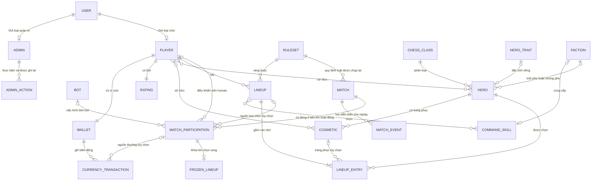

# Conceptual ERD: bổ sung Admin và Bot

Đối chiếu mã nguồn ngày 24/09/2026. Đây là mô hình khái niệm có phần mở rộng được đánh dấu; không phải tuyên bố tất cả chức năng đã triển khai. Bản kéo thả để sửa/nộp: [Conceptual_ERD_Admin_Bot.drawio](/D:/Code/Github/HeroChessBackend/docs/Conceptual_ERD_Admin_Bot.drawio) — mở bằng diagrams.net, gồm ba trang.

## 1. Nên sửa bản cũ như thế nào?

**USER là cha; PLAYER và ADMIN là hai subtype loại trừ nhau.** Admin chỉ quản trị; Player mới chơi. Bot là bên máy trong trận, không phải User. Code đã dùng kế thừa thật và EF TPH, lưu cả hai subtype trong bảng user_account. Xem [chi tiết refactor](/D:/Code/Github/HeroChessBackend/docs/User_Player_Admin_Refactor.md).

Trong ERD, thể hiện dữ liệu và quan hệ. Những việc như “khóa người chơi”, “chỉnh SP”, “cấu hình bot” là chức năng nên trình bày thêm bằng bảng quyền/use case. Không cần vẽ một thực thể riêng cho từng nút chức năng hoặc nối Admin đến mọi bảng.

Ký hiệu: `||` đúng một; `o|` không hoặc một; `o{` không hoặc nhiều; `|{` một hoặc nhiều. Mermaid không diễn tả trực tiếp “đúng 2”, XOR và điều kiện theo trạng thái; phải đọc cùng các ràng buộc sau. `PLAYER` và `ADMIN` là các tập con của `USER`, loại trừ nhau và bao phủ tài khoản được lưu. Quan hệ ISA không có nghĩa mỗi subtype có bảng riêng; code dùng một bảng TPH.

## 2. Ràng buộc phải ghi cạnh sơ đồ

1. **Mỗi participation là human XOR bot**: human phải có player; bot không có player, phải có cấu hình bot. Không được cả hai hoặc không có loại nào. Mỗi trận hoạt động có đúng hai participation, một Red và một Black.
2. Ranked hiện là hai người thật; mode bot là một người thật và một bot. Bot không đăng nhập, không có ví, ownership hoặc Elo cá nhân. “Độ khó bot” khác “rating người chơi”.
3. `BOT` trên conceptual là cấu hình/đặc tính của đối thủ máy. Hiện code nhúng cấu hình vào participation; **chưa có bảng `Bot`/`BotProfile` độc lập**. Nếu cần nhiều bot dùng lại, thêm `BOT_PROFILE`, ví dụ tên, strategy, difficulty, think budget. Participation vẫn giữ bản sao cấu hình lúc vào trận.
4. `LINEUP` là đội hình người chơi lưu và có thể sửa. `FROZEN_LINEUP` là bản sao dùng trong trận. Khi trận bắt đầu, mỗi bên phải có snapshot; xóa/sửa lineup gốc không làm đổi bàn cờ. Trong lúc selecting có thể chưa có snapshot đầy đủ. Bot hiện sao chép lineup người chơi, nên không bắt buộc sở hữu một `LINEUP` riêng.
5. Theo quyết định thiết kế mới, hero thuộc **tối đa một phe**; hero cơ bản có thể không phe. Nếu sau này yêu cầu mọi hero phải có phe, đổi đầu `FACTION` thành đúng một. **Schema hiện vẫn có bảng nối `hero_faction` cho nhiều phe**: cần thêm ràng buộc unique theo hero hoặc chuyển FK nếu triển khai luật một phe. Sơ đồ này không tự sửa database.
6. Quyền dùng command skill xét đội hình lúc bắt đầu và giữ sau khi mất quân. Ngưỡng cụ thể 2–3 tướng cần cấu hình/chốt theo từng skill. Hiện mới có dữ liệu lựa chọn/snapshot, chưa có gameplay skill hoàn chỉnh.
   Cardinality theo schema hiện tại: mỗi phe có 0..1 command skill, mỗi command skill thuộc 0..1 phe (`team_skill.faction_id` nullable và UNIQUE). Bản vẽ trước tổng quát thành nhiều skill/phe là rộng hơn code; muốn nhiều skill/phe phải đổi constraint.
7. Đổi cân bằng áp dụng cho trận mới theo dữ liệu đã đóng băng; không sửa state của trận đang chơi. Hiện snapshot bao gồm các trường đã có trong code, chưa phải hệ thống phát hành mọi loại effect/config theo phiên bản.
8. Audit ghi actor, loại đối tượng, ID, trước/sau, lý do, thời gian. Liên kết đến đối tượng đích hiện là cặp `EntityType + EntityId`, **không phải các FK trực tiếp** đến Hero/Player/Ruleset.

## 3. Admin nên có quyền gì?

| Nhóm | Chức năng đề xuất | Tình trạng thực tế |
|---|---|---|
| Giá cửa hàng | Đổi giá hero/cosmetic, nhập lý do, lưu trước/sau | **Đã có API**, role `admin`, transaction và audit |
| Truy vết | Xem lịch sử thao tác admin | **Đã có**, phân trang bằng cursor |
| Người chơi | Tìm/xem hồ sơ; khóa/mở khóa có lý do | **Đề xuất API quản trị**; đã có policy kiểm tra status ở API và WS gameplay |
| Cân bằng hero | Chỉnh SP, bật/tắt hero; sau đó mới thêm parameters cho trait | **Đề xuất**; có dữ liệu catalog, chưa có API chỉnh cân bằng |
| Luật trận | Cấu hình turn seconds, action limit, setup budget | **Đề xuất**; ruleset được lưu/chụp trong code, chưa có giao diện/API quản trị |
| Skill/phe | Chỉnh ngưỡng mở, cooldown, charges, parameters được hỗ trợ | **Đề xuất sau khi có luật skill**; không hứa admin tự tạo mọi chiêu bằng form |
| Bot | Chọn strategy, cấu hình độ khó/thời gian suy nghĩ | **Đề xuất**; đã có bot chọn nước hợp lệ, chưa có nhiều mức Elo |
| Trận đấu | Tra cứu trận, kết quả/replay phục vụ hỗ trợ | **Đề xuất quyền admin**; API lịch sử/replay hiện dành participant, admin không tự động được xem mọi trận |

Phạm vi hợp lý để báo cáo: giữ **đổi giá + audit** là chức năng đã làm; chọn **quản lý trạng thái player + chỉnh SP/bật tắt hero** làm hai mở rộng ưu tiên. Không cần làm dashboard quản lý mọi bảng để conceptual ERD có Admin.

Policy hiện đối chiếu User.Role/Status với DB; WS kiểm tra tại handshake và từng message, nên không chỉ tin role claim cũ. Chưa có API quản trị để khóa/mở hoặc đổi loại tài khoản.

## 4. Ánh xạ ngược về code

| Khái niệm trong sơ đồ | Code/lưu trữ hiện tại | Ghi chú |
|---|---|---|
| USER / PLAYER / ADMIN | `User`, `Player : User`, `Admin : User`, `AccountPolicies` | Một bảng user_account; role phân biệt subtype; policy kiểm tra DB |
| ADMIN_ACTION | `AdminAuditLog`, `AdminService` | Hiện action `price.update` |
| BOT | `MatchParticipant.ParticipantType`, `BotConfig`, `BotTurnScheduler` | JSON cấu hình, chưa có bot profile table; bot ưu tiên ăn quân có SP cao, chưa phải engine Elo |
| MATCH_PARTICIPATION | `MatchParticipant` | PlayerId nullable cho bot, snapshot đội hình, side, kết quả thưởng |
| MATCH / RULESET | `GameMatch`, `Ruleset`, `RulesetSnapshot` | Tách catalog bộ luật với bản chụp trong trận |
| LINEUP / LINEUP_ENTRY | `SavedLineup`, `SavedLineupEntry`, `SavedLineupSkill` | Team skill chọn qua bản ghi slot |
| FROZEN_LINEUP | `FrozenLineup`, `LineupSnapshot` JSON | Khái niệm snapshot, không có bảng riêng |
| HERO / HERO_TRAIT / CHESS_CLASS | `Hero`, `HeroTrait`, `ChessClass` | Mỗi hero có 0..1 trait; một trait chỉ gắn tối đa một hero. Hai trait có thể dùng chung handler |
| FACTION / COMMAND_SKILL | `Faction`, `HeroFaction`, `TeamSkill` | Quan hệ hero–phe hiện chưa khớp luật một phe mới |
| Sở hữu hero/cosmetic | `PlayerHero`, `PlayerCosmetic` | Bảng nối ownership khác với định nghĩa nội dung |
| RATING | `PlayerRating` và Elo trước/sau trong participation | Kết quả ranked ảnh hưởng rating qua settlement |
| WALLET / CURRENCY_TRANSACTION | `PlayerWallet`, `CoinTransaction` | Prototype chỉ có coin, không có bảng `Currency` riêng |
| MATCH_EVENT / REPLAY | `MatchAction.StateAfter` và `MatchHistoryService` | Replay dựng từ log snapshot; chưa có bảng `Replay` |

`MatchState` là snapshot hiện tại, còn `MatchAction` là lịch sử. Có thể thêm `MATCH_STATE` vào logical ERD khi trình bày lưu trữ; không bắt buộc đưa mọi bảng kỹ thuật (auth identity, slot template...) vào conceptual overview.

Quyết định trait ngày 24/09: mỗi hero có bản định nghĩa trait riêng để đặt tên/mô tả/parameters độc lập. Đầu HERO và HERO_TRAIT đều là 0..1 ở mức lưu trữ: hero có thể chưa có trait, trait nháp có thể chưa được gán. Trait đã gán không được chia sẻ sang hero thứ hai; dùng chung implementation key không đồng nghĩa dùng chung trait ID. Migration `07_exclusive_hero_traits.sql` tách dữ liệu chia sẻ cũ và thêm unique index cho `hero.trait_id`.

So với hình cũ: giữ `REPLAY` nếu thầy muốn tên khái niệm này, nhưng ghi “được dựng từ diễn biến trận”. `CURRENCY` có thể giữ trong mô hình sản phẩm nhiều tiền tệ tương lai; nếu báo cáo đúng prototype hiện tại thì gộp thành ví coin sẽ sát code hơn. Coin mua hàng không sinh từ participation, nên quan hệ nguồn thưởng phải tùy chọn.

Nguồn đối chiếu: [Entities.cs](/D:/Code/Github/HeroChessBackend/HeroChess.Api/Data/Entities.cs), [AdminService.cs](/D:/Code/Github/HeroChessBackend/HeroChess.Api/Services/AdminService.cs), [BotTurnScheduler.cs](/D:/Code/Github/HeroChessBackend/HeroChess.Api/Services/BotTurnScheduler.cs), [MatchmakingService.cs](/D:/Code/Github/HeroChessBackend/HeroChess.Api/Services/MatchmakingService.cs), [MatchSelectionService.cs](/D:/Code/Github/HeroChessBackend/HeroChess.Api/Services/MatchSelectionService.cs).

## 5. Cách giải thích ngắn với thầy

“Em mô hình hóa User là tài khoản chung, Player và Admin là hai loại riêng. Admin chỉ quản trị và có nhật ký ghi lại thao tác. Prototype đã hỗ trợ đổi giá và xem audit; quản lý người chơi và chỉnh chỉ số cân bằng là phạm vi mở rộng. Bot được mô hình hóa riêng với người chơi và tham gia trận qua Match Participation, không có tài khoản hay ví. Mỗi bên trong trận do một người chơi hoặc bot điều khiển. Cấu hình bot và đội hình được chụp lại để trận không bị thay đổi khi dữ liệu gốc được chỉnh sửa.”
