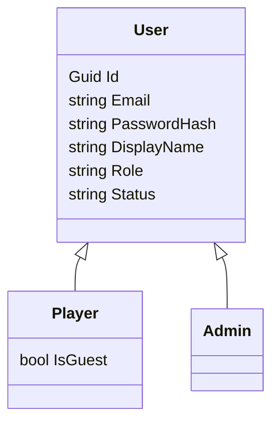

# User → Player / Admin

Cập nhật 24/09/2026 theo quyết định: **Admin chỉ quản trị, Player mới chơi game**. Hai subtype loại trừ nhau; Bot không phải User.



## Code và database

`User` chứa thông tin đăng nhập và thông tin tài khoản chung. `Player : User` và `Admin : User` là hai lớp con thật trong [Entities.cs](/D:/Code/Github/HeroChessBackend/HeroChess.Api/Data/Entities.cs). EF Core dùng **TPH**: cả hierarchy nằm trong một bảng `hero_chess.user_account`, cột `role` phân biệt subtype. `db.Players` tự lọc `role=player`, `db.Admins` lọc `role=admin`, `db.Users` đọc cả hai. Đây là cách ánh xạ được EF Core hỗ trợ; xem [tài liệu inheritance chính thức](https://learn.microsoft.com/en-us/ef/core/modeling/inheritance).

Không có bảng `player`/`admin` rỗng chỉ để giữ ID. Các bảng nghiệp vụ như `player_wallet`, `player_rating`, `lineup`, ownership và match vẫn giữ tên phù hợp với vai trò chơi game. FK của chúng trỏ tới `user_account`; trigger chặn thêm/chuyển ownership gameplay sang Admin. Dữ liệu lịch sử từ thời admin còn được chơi vẫn giữ nguyên để không phá FK, replay, ledger hoặc settlement còn lại.

`User` không khai báo abstract vì `MapIdentityApi<User>()` yêu cầu constructor không tham số để tạo object đăng ký. `UserStore.CreateAsync` chuyển object tạm đó thành Player/Admin trước khi lưu. Discriminator `unassigned` của User gốc không được DB chấp nhận. Client không được chọn role qua JSON đăng ký. Whitelist email admin vẫn chỉ là tiện ích Development đã có, không phải quy trình cấp quyền production.

## Phân quyền

| API | Player active | Admin active |
|---|---|---|
| `/api/v1/me` | Tài khoản + thông tin game | Tài khoản, các trường game null |
| `/api/v1/catalog` | Catalog kèm ownership | Catalog, không có ownership |
| Đội hình, hero sở hữu, shop, matchmaking | Cho phép | 403 |
| State/legal moves/commands/selection/history/replay | Theo quyền participant | 403 |
| Cấp vé WS, kết nối và message gameplay | Theo quyền player/participant | Bị chặn |
| Admin đổi giá và xem audit | 403 | Cho phép |

[AccountPolicies.cs](/D:/Code/Github/HeroChessBackend/HeroChess.Api/Auth/AccountPolicies.cs) đối chiếu role/status hiện tại trong DB. Token cũ hoặc claim role giả không vượt qua kiểm tra loại tài khoản. Socket kiểm tra lại lúc dùng vé và từng message. Disabled bị từ chối ở API được bảo vệ; thay đổi này chưa bổ sung API khóa/mở khóa người dùng hay dashboard admin.

`ICurrentUser.UserId` thay `ICurrentPlayer.PlayerId` tại boundary đăng nhập; tham số `playerId` trong nghiệp vụ chơi vẫn giữ nghĩa Player. Audit đổi thành `ActorUserId`/`actor_user_id` vì actor là Admin User, không phải Player.

## Contract `/me` thay đổi

Player:

```json
{"userId":"<uuid>","displayName":"Player","role":"player","status":"active","playerId":"<cùng uuid>","isGuest":false,"coinBalance":"1000","elo":1000}
```

Admin:

```json
{"userId":"<uuid>","displayName":"Admin","role":"admin","status":"active","playerId":null,"isGuest":null,"coinBalance":null,"elo":null}
```

Client mới dùng `userId` cho danh tính chung; chỉ đọc trường game sau khi xác định `role=player`. Coin vẫn là string. Audit DTO nay dùng `actorUserId`. Đây là thay đổi contract có chủ đích, cần cập nhật client Unity nếu đã đọc các trường cũ. Web demo hiện dùng auth token và không phụ thuộc cấu trúc `/me` để vận hành bàn cờ.

## Migration và bootstrap

[06_user_inheritance.sql](/D:/Code/Github/HeroChessBackend/HeroChess.Api/Data/Bootstrap/06_user_inheritance.sql) chạy trong transaction và có advisory lock:

1. Kiểm tra orphan credential trước khi sửa; gặp orphan thì dừng, giữ schema cũ.
2. Rename `hero_chess.player` thành `user_account`, giữ UUID và các FK hiện có.
3. Copy email/username/hash/security stamp từ `identity.app_user`, tạo unique index kiểm tra xung đột.
4. Đổi `auth_identity.player_id` thành `user_id`, audit actor thành `actor_user_id`.
5. Bỏ bảng credential cũ sau khi copy thành công; thay trigger tham chiếu tên bảng cũ và thêm guard cho gameplay ownership.
6. Chạy lại được: không copy đè credential mới từ dữ liệu cũ.

Schema nguồn `01_schema.sql` và script `04_identity_schema.sql` được giữ làm baseline để kiểm thử nâng cấp. **Schema cuối cùng phải chạy qua 06**. Bootstrap mới tự xử lý thứ tự: `01` nếu DB mới → `04` nếu chưa hợp nhất → `05` → `06` → `07` (trait riêng) → `02` → `03` khi bật fixture. DB đã nâng cấp bỏ qua `04`. Seed Development và SQL constraint tests hiện nhắm schema sau `06`.

Khi áp dụng cho database hiện có: dừng API cũ, sao lưu DB, chạy migration/khởi động bản mới với bootstrap bật, kiểm tra đăng nhập và readiness. Không chạy đồng thời binary cũ với schema mới. Bộ kiểm chứng đợt này dùng PostgreSQL test riêng trên port 55434; không tự đổi connection string hoặc áp dụng migration vào DB local chính của bạn.

## File và test cần đọc

- [UserStore.cs](/D:/Code/Github/HeroChessBackend/HeroChess.Api/Auth/UserStore.cs): tạo subtype và chỉ onboarding kinh tế cho Player; adapter Identity vẫn quản lý hash/stamp như trước.
- [UserClaimsPrincipalFactory.cs](/D:/Code/Github/HeroChessBackend/HeroChess.Api/Auth/UserClaimsPrincipalFactory.cs): claims lấy từ tài khoản chung.
- [CurrentUser.cs](/D:/Code/Github/HeroChessBackend/HeroChess.Api/Auth/CurrentUser.cs): đọc user ID của request.
- [AccountInheritanceTests.cs](/D:/Code/Github/HeroChessBackend/tests/HeroChess.IntegrationTests/AccountInheritanceTests.cs): admin không có tài nguyên game, endpoint bị chặn, refresh, role spoof và disabled.
- [UserMigrationTests.cs](/D:/Code/Github/HeroChessBackend/tests/HeroChess.IntegrationTests/UserMigrationTests.cs): migration giữ hash/ID/audit/legacy wallet, chạy hai lần, guard SQL và rollback khi orphan. Tự tạo/xóa DB tên `hc_user_migration_<guid>` trên server test; tài khoản test cần quyền CREATE DATABASE.

Kết quả kiểm chứng cuối cùng xem mục cập nhật trong [ImplementationStatus.md](/D:/Code/Github/HeroChessBackend/docs/ImplementationStatus.md).
